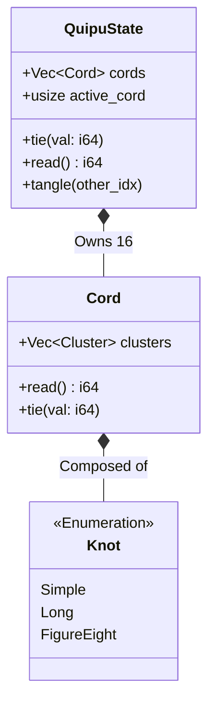

# 21. Quipu Memory System

Date: 2024-05-22

## Status

Proposed

## Context

The Chimera VM currently possesses two primary forms of state:
1.  **The Stack**: Ephemeral, local to execution context, used for immediate operations.
2.  **The Grid (Petri Dish)**: Spatial, shared, used for environment simulation and interaction.

Neither of these is suitable for "long-term, structured register memory". The Grid is volatile due to physics (diffusion, decay, entropy), and the Stack is volatile due to execution flow. The `Akashic` system provides persistent key-value storage (disk-based), but it is slow and external.

We need an internal, fast, structured memory system that allows the organism to "record" history or variables without them being washed away by the simulation's chaos. This system should align with the "ancient/biological/physical" aesthetic of Chimera.

## Decision

We will implement a **Quipu** (Khipu) Memory System, inspired by the ancient Andean recording devices.

The Quipu system consists of:
*   **QuipuState**: A collection of **Cords** (default 16).
*   **Cord**: A physical string that stores a single integer value as a sequence of **Knots**.
*   **Knots**: Physical representations of digits (Simple, Long, Figure-Eight).

### Data Structure

```rust
pub enum Knot {
    Simple,      // 10s, 100s, etc.
    Long(u8),    // 2-9 in units position
    FigureEight, // 1 in units position
}

pub struct Cord {
    pub clusters: Vec<Vec<Knot>>, // Decimal representation
}

pub struct QuipuState {
    pub cords: Vec<Cord>,
    pub active_cord: usize,
}
```

### OpCodes

We introduce the following "Nova" OpCodes to interact with the Quipu:

*   `Cord(idx)`: Selects the active cord (0-15).
*   `Knot(val)`: Ties a value onto the active cord (sets the value).
*   `Unknot()`: Unties the active cord (clears/pops the value).
*   `ReadCord()`: Reads the integer value of the active cord onto the stack.
*   `Tangle(idx)`: Entangles the active cord with another cord, summing their values.

### Visual Model



## Consequences

### Positive
*   **Structured Storage**: Provides 16 reliable registers for storing state across tick cycles.
*   **Thematic Consistency**: Fits the "ancient technology" / "biological computer" theme better than a simple `RAM` array.
*   **Topological Operations**: `Tangle` allows for interesting arithmetic combinations that feel "physical".

### Negative
*   **Complexity**: Adds another state object to the VM (`QuipuState`) that must be serialized/deserialized.
*   **Learning Curve**: Users must understand "Cords" and "Knots" instead of just "Registers".

## Compliance

*   **Refactor**: Implemented in `src/vm/nova_quipu.rs`.
*   **Integration**: Hooked into `src/vm/nova.rs` via `exec_nova_op`.
