# System Architecture

## System Context (C4)

The **Skunkworks** repository is an experimental sandbox for creative coding projects in Rust.

### Workspace Schism (ADR 082)

Due to conflicting `glam` dependency feature requirements (SIMD vs Scalar) between `bevy` and `macroquad`, the repository is intentionally fractured. Bevy-based experiments are excluded from the main workspace to allow compilation.

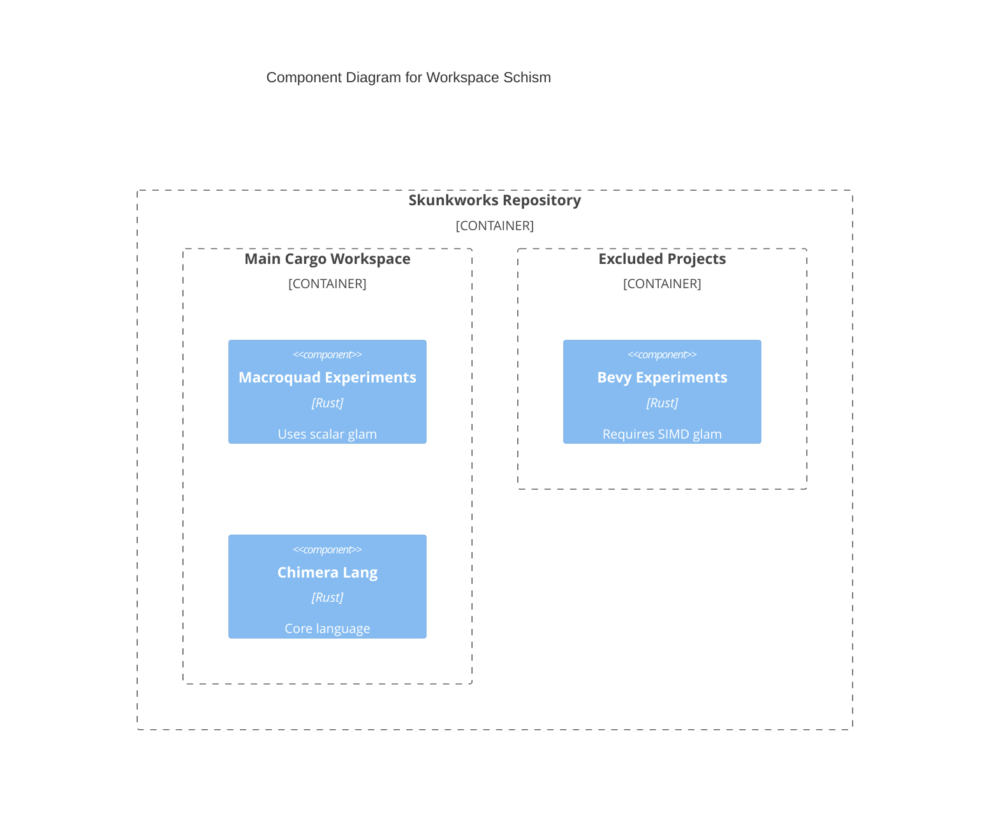
```mermaid
C4Component
    title Component Diagram for Workspace Schism

    Container_Boundary(repo, "Skunkworks Repository") {
        Container_Boundary(main_workspace, "Main Cargo Workspace") {
            Component(macroquad_exps, "Macroquad Experiments", "Rust", "Uses scalar glam")
            Component(chimera_lang, "Chimera Lang", "Rust", "Core language")
        }

        Container_Boundary(excluded_workspace, "Excluded Projects") {
            Component(bevy_exps, "Bevy Experiments", "Rust", "Requires SIMD glam")
        }
    }
```

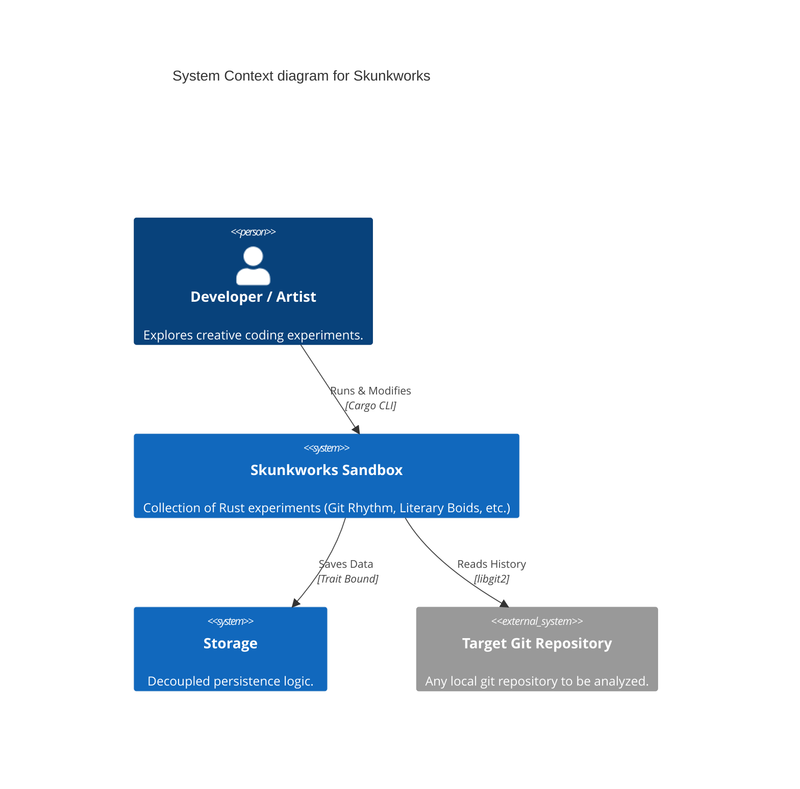
```mermaid
C4Context
    title System Context diagram for Skunkworks

    Person(user, "Developer / Artist", "Explores creative coding experiments.")
    System(skunkworks, "Skunkworks Sandbox", "Collection of Rust experiments (Git Rhythm, Literary Boids, etc.)")
    System(storage, "Storage", "Decoupled persistence logic.")
    System_Ext(git_repo, "Target Git Repository", "Any local git repository to be analyzed.")

    Rel(user, skunkworks, "Runs & Modifies", "Cargo CLI")
    Rel(skunkworks, storage, "Saves Data", "Trait Bound")
    Rel(skunkworks, git_repo, "Reads History", "libgit2")
```

## Shared Infrastructure

Common components used across multiple experiments to enforce consistency and reduce boilerplate.

### TUI Lifecycle (crates/tui-shared)

The `tui-shared` crate provides a RAII wrapper for Ratatui terminal initialization.

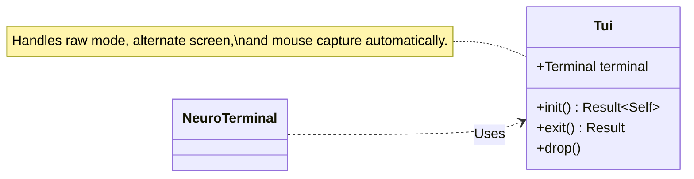
```mermaid
classDiagram
    direction LR
    class Tui {
        +Terminal terminal
        +init() Result~Self~
        +exit() Result
        +drop()
    }

    class NeuroTerminal

    NeuroTerminal ..> Tui : Uses

    note for Tui "Handles raw mode, alternate screen,\nand mouse capture automatically."
```

### Semantic Bridge (crates/tui-shared)

The semantic logic within the `tui-shared` crate enables applications to expose their internal state as structured data for LLM agents (ADR 004, ADR 070, ADR 093, ADR 096). The module hierarchy is flattened, and internal modules are kept private to enforce the Facade pattern.

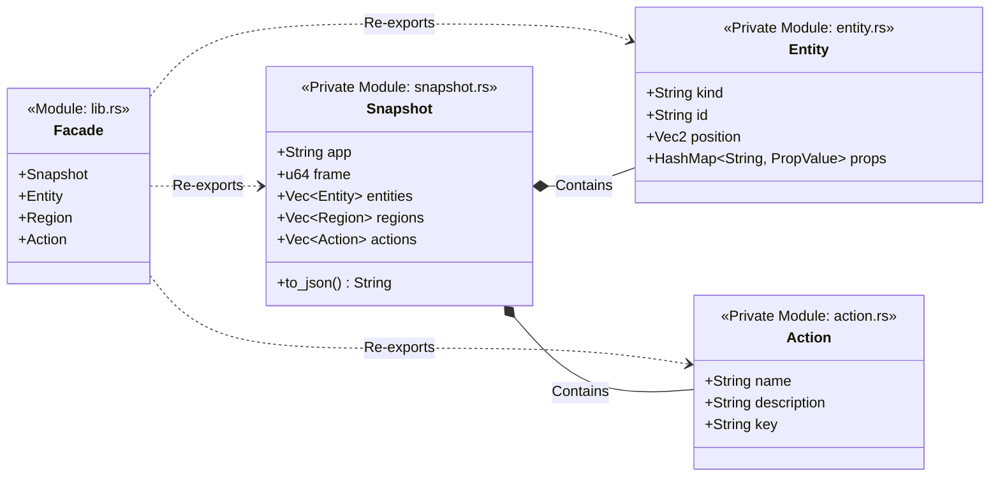
```mermaid
classDiagram
    direction LR

    class Facade {
        <<Module: lib.rs>>
        +Snapshot
        +Entity
        +Region
        +Action
    }

    class Snapshot {
        <<Private Module: snapshot.rs>>
        +String app
        +u64 frame
        +Vec~Entity~ entities
        +Vec~Region~ regions
        +Vec~Action~ actions
        +to_json() String
    }

    class Entity {
        <<Private Module: entity.rs>>
        +String kind
        +String id
        +Vec2 position
        +HashMap~String, PropValue~ props
    }

    class Action {
        <<Private Module: action.rs>>
        +String name
        +String description
        +String key
    }

    Facade ..> Snapshot : Re-exports
    Facade ..> Entity : Re-exports
    Facade ..> Action : Re-exports
    Snapshot *-- Entity : Contains
    Snapshot *-- Action : Contains
```

### Poincaré Disk (crates/poincare-disk)

The `poincare-disk` crate provides hyperbolic geometry primitives, shared by `hyperbolic-git`, `chimera-lang`, and others.

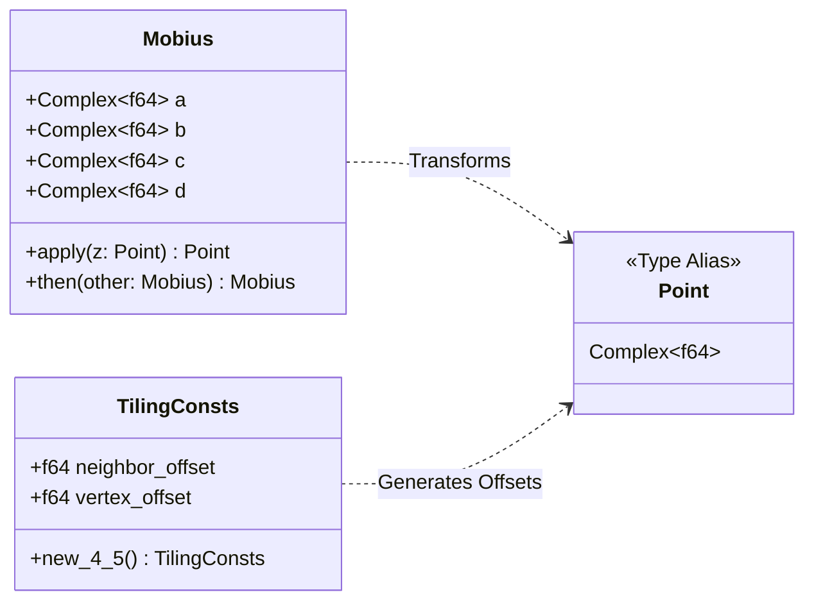
```mermaid
classDiagram
    direction LR

    class Point {
        <<Type Alias>>
        Complex~f64~
    }

    class Mobius {
        +Complex~f64~ a
        +Complex~f64~ b
        +Complex~f64~ c
        +Complex~f64~ d
        +apply(z: Point) Point
        +then(other: Mobius) Mobius
    }

    class TilingConsts {
        +f64 neighbor_offset
        +f64 vertex_offset
        +new_4_5() TilingConsts
    }

    Mobius ..> Point : Transforms
    TilingConsts ..> Point : Generates Offsets
```

### Resonance Audio (crates/resonance-audio)

The `resonance-audio` crate implements a 2D wave equation solver and audio state management, decoupled from any specific visualization.

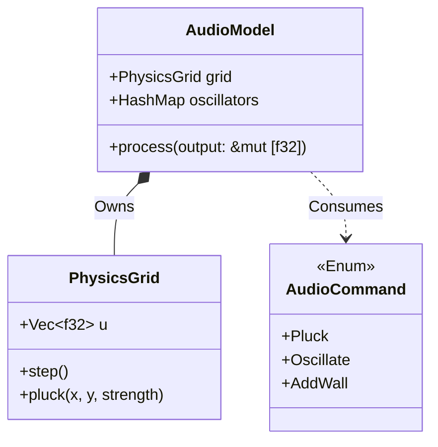
```mermaid
classDiagram
    direction TB

    class AudioModel {
        +PhysicsGrid grid
        +HashMap oscillators
        +process(output: &mut [f32])
    }

    class PhysicsGrid {
        +Vec~f32~ u
        +step()
        +pluck(x, y, strength)
    }

    class AudioCommand {
        <<Enum>>
        +Pluck
        +Oscillate
        +AddWall
    }

    AudioModel *-- PhysicsGrid : Owns
    AudioModel ..> AudioCommand : Consumes
```

### Optional Audio Backend (ADR 005)

To support CI environments without audio drivers, all audio functionality is gated behind a `feature = "audio"` flag.

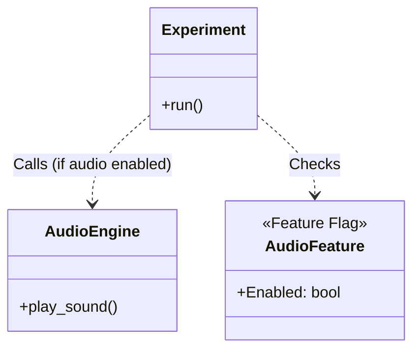
```mermaid
classDiagram
    direction TB
    class AudioFeature {
        <<Feature Flag>>
        +Enabled: bool
    }

    class Experiment {
        +run()
    }

    class AudioEngine {
        +play_sound()
    }

    Experiment ..> AudioEngine : Calls (if audio enabled)
    Experiment ..> AudioFeature : Checks
```

### TUI Button State Precedence (crates/tui-shared)

The `Button` widget uses multiple boolean flags to determine its visual appearance. Rendering precedence is strictly enforced.

```mermaid
stateDiagram-v2
    [*] --> Default

    Default --> Hovered : is_hovered = true
    Hovered --> Default : is_hovered = false

    Default --> Clicked : is_clicked = true
    Hovered --> Clicked : is_clicked = true
    Clicked --> Default : is_clicked = false

    Default --> Loading : is_loading = true
    Hovered --> Loading : is_loading = true
    Clicked --> Loading : is_loading = true
    Loading --> Default : is_loading = false

    Loading --> Success : is_success = true
    Default --> Success : is_success = true
    Success --> Default : is_success = false

    note right of Success
        Precedence Order:
        1. Success (Green, '✅')
        2. Loading (Yellow, '⏳')
        3. Clicked (Red)
        4. Hovered (Cyan)
    end note
```

### Ghost Input Replay (crates/tui-shared)

The `tui-shared` crate includes a `ghost` feature for recording and replaying user input sessions, facilitating deterministic testing and demos.

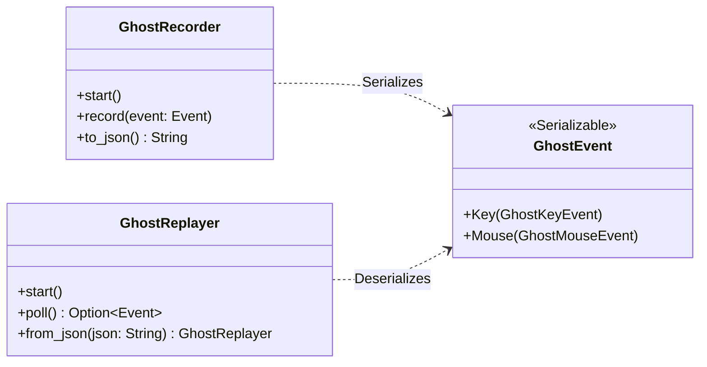
```mermaid
classDiagram
    direction LR

    class GhostRecorder {
        +start()
        +record(event: Event)
        +to_json() String
    }

    class GhostReplayer {
        +start()
        +poll() Option~Event~
        +from_json(json: String) GhostReplayer
    }

    class GhostEvent {
        <<Serializable>>
        +Key(GhostKeyEvent)
        +Mouse(GhostMouseEvent)
    }

    GhostRecorder ..> GhostEvent : Serializes
    GhostReplayer ..> GhostEvent : Deserializes
```

### GPU Compute Architecture (ADR 045)

Standardized pattern for high-performance cellular automata using WGPU Compute Shaders.

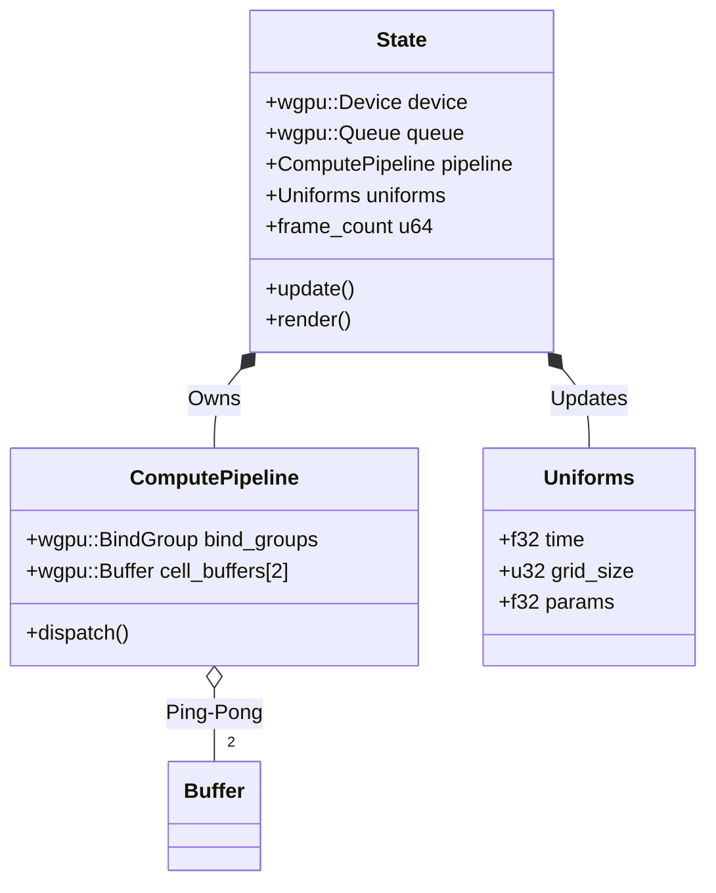
```mermaid
classDiagram
    direction TB
    class State {
        +wgpu::Device device
        +wgpu::Queue queue
        +ComputePipeline pipeline
        +Uniforms uniforms
        +frame_count u64
        +update()
        +render()
    }

    class ComputePipeline {
        +wgpu::BindGroup bind_groups
        +wgpu::Buffer cell_buffers[2]
        +dispatch()
    }

    class Uniforms {
        +f32 time
        +u32 grid_size
        +f32 params
    }

    State *-- ComputePipeline : Owns
    State *-- Uniforms : Updates
    ComputePipeline o-- "2" Buffer : Ping-Pong
```

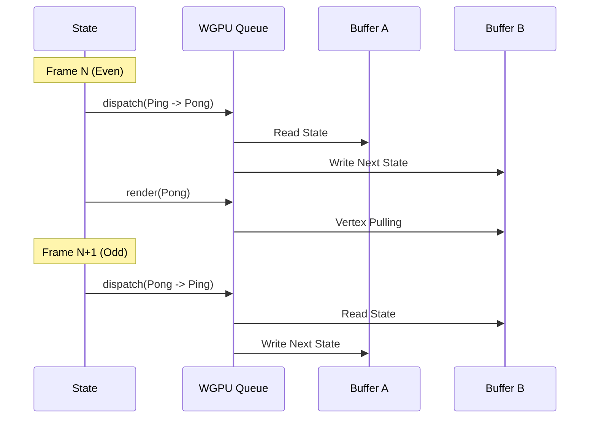
```mermaid
sequenceDiagram
    participant State
    participant GPU as WGPU Queue
    participant Ping as Buffer A
    participant Pong as Buffer B

    Note over State: Frame N (Even)
    State->>GPU: dispatch(Ping -> Pong)
    GPU->>Ping: Read State
    GPU->>Pong: Write Next State

    State->>GPU: render(Pong)
    GPU->>Pong: Vertex Pulling

    Note over State: Frame N+1 (Odd)
    State->>GPU: dispatch(Pong -> Ping)
    GPU->>Pong: Read State
    GPU->>Ping: Write Next State
```

### Storage Decoupling (ADR 006, ADR 012)

Refactoring to decouple storage from core logic to resolve circular dependencies.

#### Core vs Storage

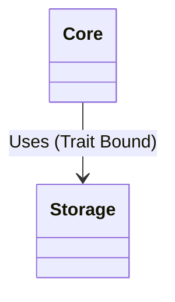
```mermaid
classDiagram
  class Core
  class Storage
  Core --> Storage : Uses (Trait Bound)
  %% Removed the circular dependency arrow
```

#### Storage Flow

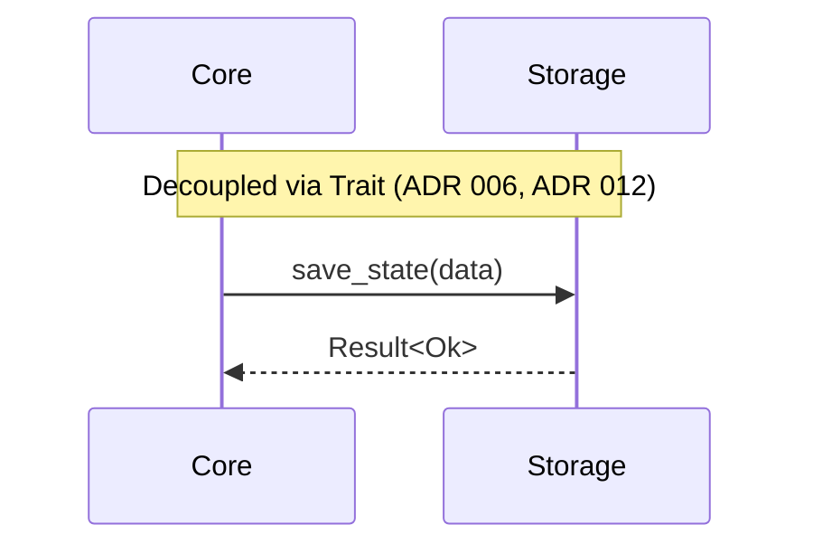
```mermaid
sequenceDiagram
    participant C as Core
    participant S as Storage

    Note over C,S: Decoupled via Trait (ADR 006, ADR 012)
    C->>S: save_state(data)
    S-->>C: Result<Ok>
```

## Shared Domain Logic

### Ferrous Core (crates/ferrous-core)

Centralized logic and data structures for magnetic field and fluid density simulations across the Ferrous ecosystem (ADR 067).

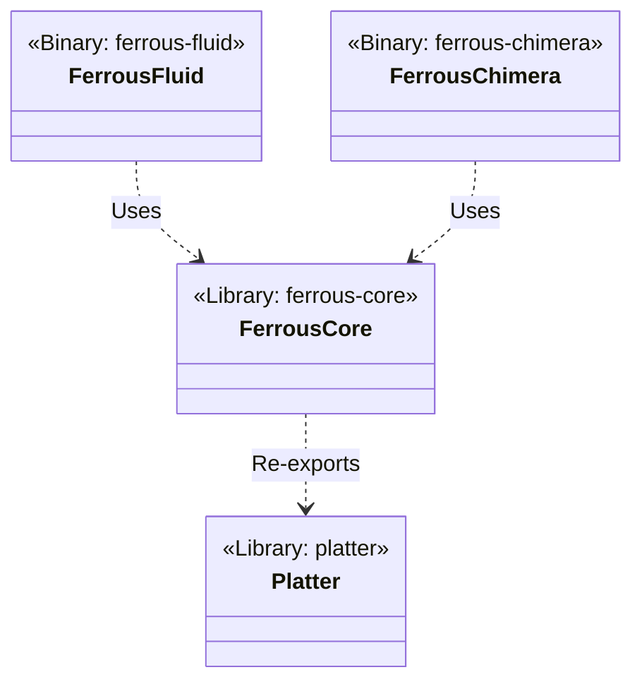
```mermaid
classDiagram
    direction TB
    class FerrousCore {
        <<Library: ferrous-core>>
    }

    class Platter {
        <<Library: platter>>
    }

    class FerrousFluid {
        <<Binary: ferrous-fluid>>
    }

    class FerrousChimera {
        <<Binary: ferrous-chimera>>
    }

    FerrousCore ..> Platter : Re-exports
    FerrousFluid ..> FerrousCore : Uses
    FerrousChimera ..> FerrousCore : Uses
```

### Platter Field Logic (crates/platter)

Standardized scalar field simulation logic for magnetism, fluid density, and pheromones (ADR 062).

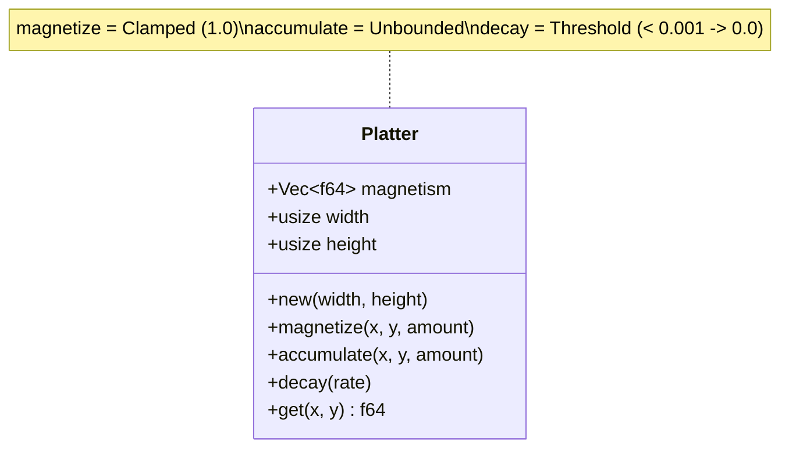
```mermaid
classDiagram
    direction TB
    class Platter {
        +Vec~f64~ magnetism
        +usize width
        +usize height
        +new(width, height)
        +magnetize(x, y, amount)
        +accumulate(x, y, amount)
        +decay(rate)
        +get(x, y) f64
    }

    note for Platter "magnetize = Clamped (1.0)\naccumulate = Unbounded\ndecay = Threshold (< 0.001 -> 0.0)"
```

Specialized libraries that encapsulate specific domain knowledge or data structures, reused across multiple experiments.

### Quipu Data Structures (crates/quipu)

Encapsulates Inca recording devices (`Knot`, `Cord`, `Quipu`) to ensure consistent representation and behavior (ADR 024).

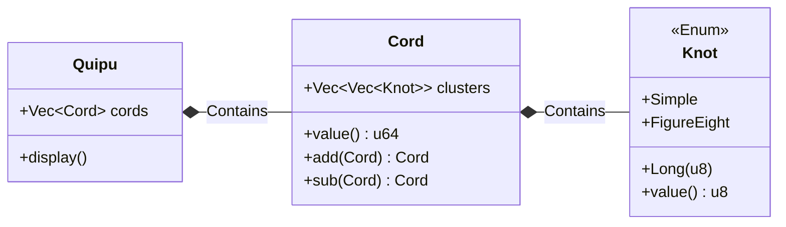
```mermaid
classDiagram
    direction LR
    class Quipu {
        +Vec~Cord~ cords
        +display()
    }

    class Cord {
        +Vec~Vec~Knot~~ clusters
        +value() u64
        +add(Cord) Cord
        +sub(Cord) Cord
    }

    class Knot {
        <<Enum>>
        +Simple
        +Long(u8)
        +FigureEight
        +value() u8
    }

    Quipu *-- Cord : Contains
    Cord *-- Knot : Contains
```

### Locus Geometry (crates/locus)

Provides standard vector math (2D, 3D, 4D) and topological wrapping logic (ADR 025, ADR 059).

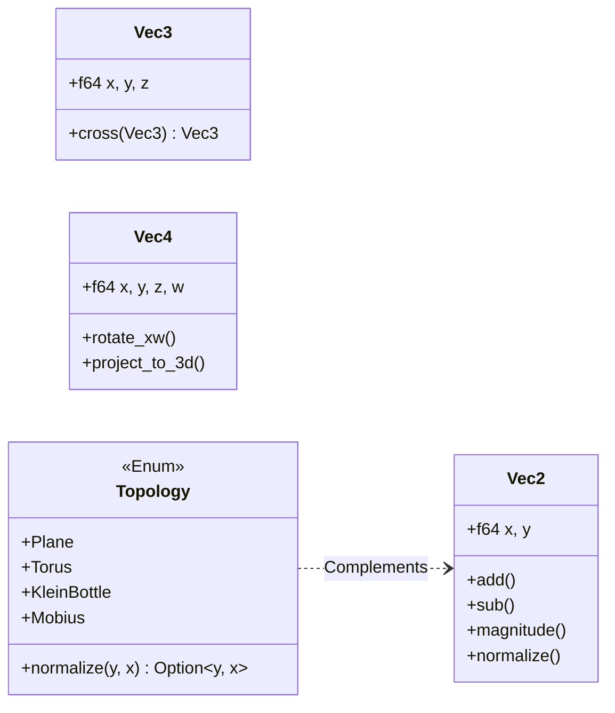
```mermaid
classDiagram
    direction LR
    class Vec2 {
        +f64 x, y
        +add()
        +sub()
        +magnitude()
        +normalize()
    }
    class Vec3 {
        +f64 x, y, z
        +cross(Vec3) Vec3
    }
    class Vec4 {
        +f64 x, y, z, w
        +rotate_xw()
        +project_to_3d()
    }

    class Topology {
        <<Enum>>
        +Plane
        +Torus
        +KleinBottle
        +Mobius
        +normalize(y, x) Option~y, x~
    }

    Topology ..> Vec2 : Complements
```

### Flocking Logic (crates/flocking)

Encapsulates Craig Reynolds' "Boids" algorithm logic, extracting AI simulation physics from pure geometry primitives (ADR 032).

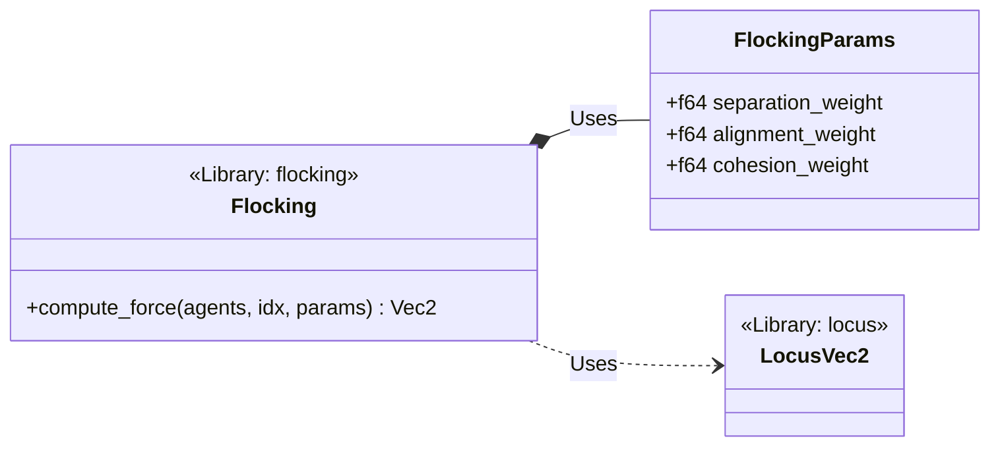
```mermaid
classDiagram
    direction LR
    class Flocking {
        <<Library: flocking>>
        +compute_force(agents, idx, params) Vec2
    }
    class FlockingParams {
        +f64 separation_weight
        +f64 alignment_weight
        +f64 cohesion_weight
    }
    class LocusVec2 {
        <<Library: locus>>
    }

    Flocking *-- FlockingParams : Uses
    Flocking ..> LocusVec2 : Uses
```

### Market Simulation (crates/market-sim)

Implements a Continuous Double Auction (CDA) using a physics-based particle system (ADR 026).

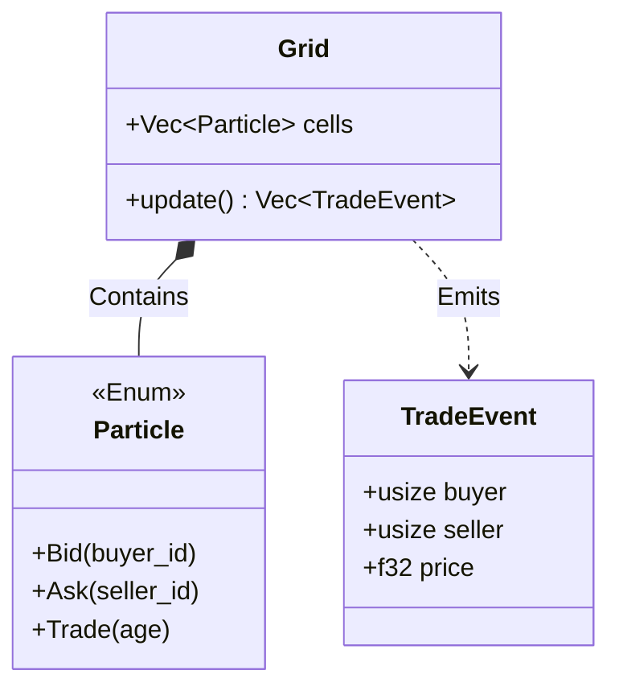
```mermaid
classDiagram
    direction TB
    class Grid {
        +Vec~Particle~ cells
        +update() Vec~TradeEvent~
    }

    class Particle {
        <<Enum>>
        +Bid(buyer_id)
        +Ask(seller_id)
        +Trade(age)
    }

    class TradeEvent {
        +usize buyer
        +usize seller
        +f32 price
    }

    Grid *-- Particle : Contains
    Grid ..> TradeEvent : Emits
```

### Synaptic Physics (crates/synaptic-physics)

Encapsulates the Izhikevich neuron model for biologically plausible neural simulations (ADR 027).

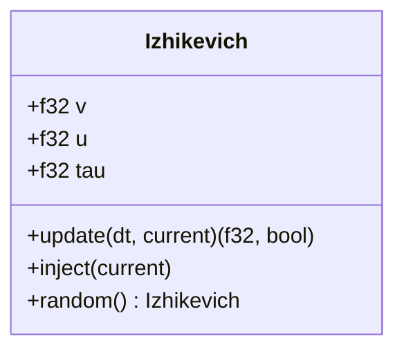
```mermaid
classDiagram
    class Izhikevich {
        +f32 v
        +f32 u
        +f32 tau
        +update(dt, current) (f32, bool)
        +inject(current)
        +random() Izhikevich
    }
```

### Git Associates (crates/git-associates)

Helper utilities for scanning and parsing Git history, used by `tectonic-git` and others (ADR 033).

```mermaid
classDiagram
    class GitAssociates {
        <<Library>>
    }
    class GitModel {
        +open(path)
        +history(limit)
        +diff_workdir()
    }

    class Commit {
        +String hash
        +String message
        +CommitStats stats
        +Vec~FileChange~ files
    }

    class FileChange {
        +String path
        +Vec~Hunk~ hunks
    }

    GitAssociates *-- GitModel : Exports
    GitModel ..> Commit : Produces
    Commit *-- FileChange : Contains
```

### Soroban Logic (crates/soroban)

The `soroban` crate encapsulates the logic of the Japanese Abacus, modeling state as physical bead positions rather than just integer values (ADR 034).

```mermaid
classDiagram
    direction TB
    class Soroban {
        +[Column; 13] columns
        +add(val: u64)
        +sub(val: u64)
        +value() u64
    }

    class Column {
        +bool upper_active
        +u8 lower_active
        +value() u8
    }

    class SorobanMarket {
        <<Experiment>>
        +render_tui(soroban)
    }

    class SorobanSpecter {
        <<Experiment>>
        +render_fluid(soroban)
    }

    Soroban *-- Column : Composes
    SorobanMarket ..> Soroban : Visualizes
    SorobanSpecter ..> Soroban : Visualizes
```

### Origami Logic (crates/origami)

Encapsulates Miura-ori folding geometry, separating mathematical vertex generation from rendering (ADR 040, ADR 098). Includes strict vector capacity bounding to prevent out-of-memory DoS vectors.

```mermaid
classDiagram
    direction TB
    class MiuraOri {
        +MiuraParams params
        +generate_mesh(extension) OrigamiMesh
        +generate_grid(extension) Vec~Vec3~
    }

    class MiuraParams {
        +f32 a
        +f32 b
        +f32 gamma
        +Orientation orientation
    }

    class OrigamiMesh {
        +Vec~OrigamiVertex~ vertices
        +Vec~u16~ indices
    }

    class Orientation {
        <<Enum>>
        +Horizontal
        +Vertical
    }

    MiuraOri *-- MiuraParams : Configured by
    MiuraOri ..> OrigamiMesh : Produces
```

### Gray-Scott Simulation (crates/gray-scott)

Provides a shared, optimized Gray-Scott reaction-diffusion simulation kernel with optional parallel updates (ADR 041).

```mermaid
classDiagram
    direction TB
    class GrayScott {
        +Vec~f32~ u
        +Vec~f32~ v
        +update(feed, kill, dt)
        +add_chemical(x, y, amt)
    }

    class Rayon {
        <<Library>>
        +par_iter_mut()
    }

    GrayScott ..> Rayon : Uses (if feature=parallel)
    note for GrayScott "Implements 3x3 Laplacian Convolution"
```

### Neuro Simulation (crates/neuro-sim)

Provides a high-level network simulation layer for spiking neural networks, managing synaptic connectivity and propagation delays (ADR 043).

```mermaid
classDiagram
    direction TB
    class Network {
        +Vec~Izhikevich~ neurons
        +Vec~Synapse~ synapses
        +Vec~bool~ spikes
        +step(external_inputs)
        +is_spiking(index) bool
    }

    class Synapse {
        +usize from
        +usize to
        +f32 weight
        +usize delay
    }

    class Izhikevich {
        <<Library: synaptic-physics>>
        +update()
    }

    Network *-- Synapse : Contains
    Network *-- Izhikevich : Contains
    Synapse ..> Izhikevich : Connects
```

### Physics PBD (crates/physics-pbd)

Implements a Position Based Dynamics engine for simulating physical constraints and particle interactions (ADR 044).

```mermaid
classDiagram
    direction TB
    class PbdSystem {
        +Vec~Particle~ particles
        +Vec~Constraint~ constraints
        +step(dt, iterations)
        +add_particle(pos, mass) usize
        +add_distance_constraint(p1, p2, stiffness)
    }

    class Particle {
        +Vec3 pos
        +Vec3 prev_pos
        +Vec3 vel
        +f32 inv_mass
    }

    class Constraint {
        <<Enum>>
        +Distance
        +Actuator
        +Pin
    }

    PbdSystem *-- Particle : Manages
    PbdSystem *-- Constraint : Enforces
    Constraint ..> Particle : Affects
```

### Hyper System (crates/hyper-system)

Provides system monitoring utilities for "Hyper" series experiments, re-exporting 4D math from `locus` (ADR 050, ADR 059).

```mermaid
classDiagram
    direction TB
    class SystemMonitor {
        +f32 cpu_usage
        +f32 mem_usage
        +f32 swap_usage
        +f32 load_avg
        +update_with_time(dt, now)
        +update()
    }

    note for SystemMonitor "Uses locus::Vec4\nInterpolates metrics for smooth visuals"
```

## Experiment: Git Harmony

**Git Harmony** (formerly Git Rhythm) generates music from git diffs ("Code Singing").

### Component Structure

```mermaid
classDiagram
    direction LR
    class DiffState {
        +Vec~FileDiff~ files
    }

    class VisualNote {
        +f32 pitch
        +f32 color_hue
        +String text
    }

    class Synthesizer {
        -DiffState diff
        -Vec~VisualNote~ active_notes
        +new(diff: DiffState)
        +tick()
        +play_event(event: LineChange)
    }

    class RodioSink {
        <<Optional Audio>>
        +append(source)
    }

    Synthesizer *-- DiffState : Iterates
    Synthesizer *-- VisualNote : Generates
    Synthesizer ..> RodioSink : Uses (if feature=audio)

    note for Synthesizer "Maps file hash -> Frequency\nMaps DiffType -> Color"
```

## Experiment: Chimera Lang (ADR 008)

**Chimera Lang** is a bio-inspired, stack-based esoteric programming language with an optional "Nova" expansion for advanced biological simulation.

### ChimeraVM Execution Engine (ADR 074, ADR 076, ADR 078, ADR 079, ADR 083, ADR 090, ADR 097, ADR 155)

The `ChimeraVM` execution logic is decoupled into domain-specific submodules within the `vm::ops` module.

```mermaid
classDiagram
    direction TB
    class ChimeraVM {
        <<Struct>>
        +step()
        +execute_gene()
    }

    class CoreOps {
        <<Module: ops/core_dispatch.rs>>
        +exec_core_op()
    }

    class MiscOps {
        <<Module: ops/misc.rs>>
        +exec_prion_op()
        +exec_transposon()
    }

    class MathOps {
        <<Module: ops/math.rs>>
        +exec_math_op()
        -binary_op()
    }

    class StackOps {
        <<Module: ops/stack.rs>>
        +exec_stack_op()
    }

    class FlowOps {
        <<Module: ops/flow.rs>>
        +exec_flow_op()
    }

    class GridOps {
        <<Module: ops/grid.rs>>
        +exec_grid_op()
    }

    class IoOps {
        <<Module: ops/io.rs>>
        +exec_io_op()
    }

    class BioOps {
        <<Module: ops/bio.rs>>
        +exec_bio_op()
    }

    class MutationOps {
        <<Module: ops/mutation.rs>>
    }

    class StringOps {
        <<Module: ops/string.rs>>
    }

    class ResourceOps {
        <<Module: ops/resource.rs>>
    }

    class RibosomeOps {
        <<Module: ops/ribosome.rs>>
    }

    class NovaDispatchOps {
        <<Module: ops/nova_dispatch.rs>>
        +exec_nova_dispatch()
    }

    CoreOps ..> ChimeraVM : Extends (impl)
    MiscOps ..> ChimeraVM : Extends (impl)
    MathOps ..> ChimeraVM : Extends (impl)
    StackOps ..> ChimeraVM : Extends (impl)
    FlowOps ..> ChimeraVM : Extends (impl)
    GridOps ..> ChimeraVM : Extends (impl)
    IoOps ..> ChimeraVM : Extends (impl)
    BioOps ..> ChimeraVM : Extends (impl)
    MutationOps ..> ChimeraVM : Extends (impl)
    StringOps ..> ChimeraVM : Extends (impl)
    ResourceOps ..> ChimeraVM : Extends (impl)
    RibosomeOps ..> ChimeraVM : Extends (impl)
    NovaDispatchOps ..> ChimeraVM : Extends (impl)
```

### ChimeraVM Encapsulation (ADR 108)

The internal module structure of the ChimeraVM and the `chimera-lang` crate is encapsulated using the Facade pattern. Deeply nested execution modules are hidden behind `pub(crate) mod`, with only the required APIs publicly exported.

```mermaid
classDiagram
    direction TB
    namespace CrateFacade {
        class LibRS {
            <<Facade>>
            +prelude::*
            +ChimeraVM
        }
    }
    namespace InternalModules {
        class VmMod {
            <<pub(crate)>>
            +organelles
            +systems
        }
        class OtherInternal {
            <<pub(crate)>>
            +acoustic_compiler
            +matrix_rain
        }
    }
    class Consumer {
        <<External>>
    }

    LibRS ..> VmMod : pub use ChimeraVM
    Consumer --> LibRS : Uses

    note for InternalModules "Internal logic is hidden from Consumer"
```

### ChimeraVM System Sub-processors (ADR 095)

The `ChimeraVM` operational loops are decoupled into domain-specific subsystem processors within the `vm::systems` module.

```mermaid
classDiagram
    direction TB
    class ChimeraVM {
        <<Struct>>
        +step()
        +execute_gene()
    }

    class EnvironmentSystem {
        <<Module: systems/environment.rs>>
        +process_environment()
    }

    class NovaEnvironmentSystem {
        <<Module: systems/nova_environment.rs>>
        +process_nova_environment()
    }

    class SymbioteSystem {
        <<Module: systems/symbiotes.rs>>
        +process_symbiotes()
    }

    class SubsystemProcessor {
        <<Module: systems/subsystems.rs>>
        +process_subsystems()
    }

    class ChaosSystem {
        <<Module: systems/chaos.rs>>
        +process_chaos_and_events()
    }

    EnvironmentSystem ..> ChimeraVM : Extends (impl)
    NovaEnvironmentSystem ..> ChimeraVM : Extends (impl)
    SymbioteSystem ..> ChimeraVM : Extends (impl)
    SubsystemProcessor ..> ChimeraVM : Extends (impl)
    ChaosSystem ..> ChimeraVM : Extends (impl)
```

### Chimera TUI Architecture (ADR 071, ADR 072, ADR 073, ADR 077, ADR 081, ADR 084, ADR 086, ADR 087, ADR 088)

The TUI event loop is decoupled into specific input handler modules to avoid a monolithic `run_app` loop. The main `run_tui` loop delegates directly to the modularized `app::run_app` execution logic, reducing `tui/mod.rs` to a lightweight facade. The handlers themselves are further decoupled into specific input type submodules.

```mermaid
classDiagram
    direction TB
    class TuiFacade {
        <<Facade: tui/mod.rs>>
        +run_tui()
        +apply_glitch_fx()
        +parse_grid_value()
    }

    class AppLoop {
        <<Module: tui/app/mod.rs>>
        +run_app()
    }

    class Handlers {
        <<Module: tui/app/handlers/mod.rs>>
        +handle_input()
    }

    TuiFacade --> AppLoop : Delegates event loop (ADR 086)
    AppLoop --> Handlers : Routes inputs

    note for TuiFacade "Massive duplicated match blocks eliminated.<br/>Facade cleanly delegates core execution to AppLoop."
```

The `tui/views/mod.rs` module acts as a strict Facade, controlling the visibility of view rendering functions using precise feature flags, rather than relying on wildcard exports.

```mermaid
classDiagram
    direction TB
    class TuiViewsFacade {
        <<Facade: tui/views/mod.rs>>
        +render_audio_views()
        +render_bio_views()
        +render_core_views()
        +render_magic_views()
        +render_misc_views()
        +render_physics_views()
        +render_tech_views()
    }

    class AudioViews {
        <<Module: tui/views/audio.rs>>
    }

    class BioViews {
        <<Module: tui/views/bio.rs>>
    }

    class CoreViews {
        <<Module: tui/views/core.rs>>
    }

    class MagicViews {
        <<Module: tui/views/magic.rs>>
    }

    class MiscViews {
        <<Module: tui/views/misc.rs>>
    }

    class PhysicsViews {
        <<Module: tui/views/physics.rs>>
    }

    class TechViews {
        <<Module: tui/views/tech.rs>>
    }

    TuiViewsFacade ..> AudioViews : feature="nova"
    TuiViewsFacade ..> BioViews : feature="nova", feature="biophysics"
    TuiViewsFacade ..> CoreViews : feature="nova"
    TuiViewsFacade ..> MagicViews : feature="nova"
    TuiViewsFacade ..> MiscViews : feature="nova"
    TuiViewsFacade ..> PhysicsViews : feature="nova"
    TuiViewsFacade ..> TechViews : feature="nova", feature="elektra", feature="silicon"
```

```mermaid
sequenceDiagram
    participant TuiFacade as tui/mod.rs
    participant App as tui/app/mod.rs
    participant ViewRouter as tui/app/router.rs
    participant Editing as handlers/editing/mod.rs

    TuiFacade->>App: run_app(terminal)
    Note over TuiFacade,App: Monolithic event loop extracted (ADR 086)

    loop Event Loop
        App->>ViewRouter: route_view(terminal)
        Note over App,ViewRouter: View resolution logic extracted (ADR 088)
        ViewRouter-->>App: UI Rendered
    end

    participant EditingChars as handlers/editing/chars.rs
    participant EditingActions as handlers/editing/actions.rs
    participant EditingEnter as handlers/editing/enter.rs
    participant Normal as handlers/normal/mod.rs
    participant NormalChars as handlers/normal/chars.rs
    participant NormalNav as handlers/normal/navigation.rs
    Note over NormalNav: Domain functions extracted (ADR 087)
    participant NormalActions as handlers/normal/actions.rs
    participant Selector as handlers/selector.rs

    App->>App: read_event()
    alt State == Editing
        App->>Editing: handle_input(event)
        alt is char
            Editing->>EditingChars: handle_char()
        else is action
            Editing->>EditingActions: handle_action()
        else is enter
            Editing->>EditingEnter: handle_enter()
            Note over EditingEnter: Normalized fallback & grouped cfg variants
        end
    else State == Normal
        App->>Normal: handle_input(event)
        alt is char
            Normal->>NormalChars: handle_char()
        else is navigation
            Normal->>NormalNav: handle_navigation()
        else is action
            Normal->>NormalActions: handle_action()
        end
    else State == Selector
        App->>Selector: handle_input(event)
    end
```

### Lib/Bin Split

The project exposes its core modules to allow embedding in other experiments.

```mermaid
classDiagram
    direction TB
    class ChimeraVM {
        +Dna dna
        +PetriDish grid
        +Vec~Deque~ stack
        +step()
        +execute_gene()
    }

    class Dna {
        +Helix helix
    }

    class PetriDish {
        +[[Val; 16]; 16] cells
    }

    class ExternalApp {
        <<Consumer>>
    }

    ChimeraVM *-- Dna : Owns
    ChimeraVM *-- PetriDish : Owns
    ExternalApp ..> ChimeraVM : Embeds
```

### Nova Feature: Endocrine Cycle

When `feature = "nova"` is enabled, the VM simulates a hormone diffusion cycle.

```mermaid
sequenceDiagram
    participant App
    participant VM as ChimeraVM
    participant Endocrine as HormoneGrid
    participant Enzyme

    App->>VM: step()
    VM->>VM: process_metabolism()

    opt Nova Feature
        VM->>Endocrine: diffuse()
        VM->>Endocrine: decay()
    end

    VM->>Enzyme: execute(gene)

    opt Nova Feature
        Enzyme->>Endocrine: secrete(hormone)
        Enzyme->>Endocrine: detect(hormone)
    end
```

### Nova Feature: Time Travel (ADR 013)

The `Spore` struct enables deep state snapshots, allowing the VM to backtrack execution paths.

```mermaid
classDiagram
    direction TB
    class ChimeraVM {
        +Dna dna
        +Vec~Value~ stack
        +PetriDish grid
        +Vec~Spore~ spores
        +step()
        +sporulate()
        +germinate(id)
    }

    class Spore {
        <<Snapshot>>
        +Dna dna
        +Vec~Value~ stack
        +PetriDish grid
        +usize ip
    }

    ChimeraVM *-- Spore : Manages
    ChimeraVM ..> Spore : Creates (Sporulate)
    Spore ..> ChimeraVM : Restores (Germinate)
```

```mermaid
sequenceDiagram
    participant VM
    participant SporeStorage as Vec<Spore>

    VM->>VM: Execute OpCode::Sporulate
    VM->>SporeStorage: push(clone_state())
    SporeStorage-->>VM: return spore_id (0)
    VM->>VM: Continue Execution...
    VM->>VM: Encounter Hazard (Mutation/Death)

    opt If Failure Detected
        VM->>VM: Execute OpCode::Germinate(0)
        SporeStorage->>VM: restore_state(spore_0)
        VM->>VM: State Reverted (Time Travel)
    end
```

### Nova Feature: Prion Protocol (ADR 013)

Dynamic instruction remapping allows the environment or the program itself to alter the meaning of genes.

```mermaid
stateDiagram-v2
    [*] --> Normal
    Normal --> Remapped : OpCode::Remap(Add, Sub)
    Remapped --> Normal : OpCode::Restore(Add)

    state Normal {
        Add : Adds two numbers
    }

    state Remapped {
        Add : Subtracts two numbers (Prion)
    }
```

### Nova Feature: Chorus System (ADR 014)

The Chorus System allows the VM to trigger global effects by detecting specific sequences of "notes" (strings) in a sliding window buffer.

```mermaid
sequenceDiagram
    participant VM
    participant ChorusBuffer as VecDeque<String>
    participant State as Global State

    Note over VM: Program executes Sing("Do")
    VM->>ChorusBuffer: push_back("Do")
    VM->>VM: check_chorus_chords()

    Note over VM: Program executes Sing("Mi")
    VM->>ChorusBuffer: push_back("Mi")
    VM->>VM: check_chorus_chords()

    Note over VM: Program executes Sing("Sol")
    VM->>ChorusBuffer: push_back("Sol")
    VM->>VM: check_chorus_chords()

    rect rgb(200, 255, 200)
        Note right of VM: "Genesis" Chord Detected!
        VM->>State: Spawn(Worker)
        VM->>ChorusBuffer: clear()
    end
```

### Phylogeny Feature: Host Interaction (ADR 017)

The `phylogeny` feature enables the VM to escape its sandbox and interact with the host filesystem and shell.

```mermaid
sequenceDiagram
    participant VM as ChimeraVM
    participant Phy as Phylogeny Module
    participant OS as Host OS

    VM->>Phy: exec_phylogeny_op(Crawl, path)
    Phy->>OS: fs::read_dir(path)
    OS-->>Phy: Result<Entries>
    Phy-->>VM: push(Junction(files))

    VM->>Phy: exec_phylogeny_op(Shell, "cargo build")
    Phy->>OS: Command::new("cargo").arg("build")
    OS-->>Phy: Output(stdout, stderr)
    Phy-->>VM: push(String(stdout))
```

### Chimera Feature: Sovereignty (ADR 018)

The Sovereignty system enables organisms to claim territory and tax visitors.

```mermaid
sequenceDiagram
    participant VM
    participant SovGrid as Sovereignty Grid
    participant Market

    VM->>VM: step() calls process_territory()
    VM->>SovGrid: check owner at (x, y)

    alt If cell has Owner != Visitor
        VM->>VM: get tax_rate for Owner

        opt If tax_rate > 0
            VM->>VM: deduct tax from Visitor energy
            VM->>Market: credit(Owner, tax_amount)

            opt If Visitor energy <= 0
                VM->>VM: Kill Visitor (Starvation)
            end
        end
    end
```

### Nova Feature: Chemistry System (ADR 019)

The Chemistry system allows for the creation and manipulation of chemical solutions using recipes.

```mermaid
sequenceDiagram
    participant VM
    participant Grid
    participant Chemistry as Chemistry Module

    Note over VM: OpCode::Mix(radius)
    VM->>Grid: Collect ingredients in radius
    Grid-->>Chemistry: Ingredients
    Chemistry->>Grid: Set Cell = Dish(Ingredients)

    Note over VM: OpCode::Brew(heat)
    VM->>Grid: Get Dish at (x,y)
    Grid-->>Chemistry: Ingredients
    Chemistry->>Chemistry: Match Recipe(Ingredients, Heat)
    Chemistry->>Grid: Set Cell = Dish(Solution)

    Note over VM: OpCode::Splash(x, y, radius)
    VM->>Grid: Get Solution at (x,y)
    Chemistry->>Grid: Apply Effect(Solution, TargetArea)
    Note right of Grid: Acid: Destroy<br/>Elixir: Heal<br/>Mutagen: Mutate
```

### Nova Feature: Hive Networking (ADR 020)

The Hive system enables asynchronous UDP communication between Chimera VMs, facilitating distributed simulation and swarm behavior.

```mermaid
sequenceDiagram
    participant VM
    participant HiveSocket as UDP Socket (Bound)
    participant Ephemeral as UDP Socket (Temp)

    Note over VM: OpCode::HiveBind(8080)
    VM->>HiveSocket: bind("0.0.0.0:8080")
    HiveSocket-->>VM: Ok(Arc<Socket>)

    Note over VM: OpCode::HiveSend(msg, "1.2.3.4", 9090)
    VM->>Ephemeral: bind("0.0.0.0:0")
    Ephemeral->>Ephemeral: send_to(json(msg), "1.2.3.4:9090")
    Ephemeral-->>VM: Ok

    Note over VM: OpCode::HiveRecv(8080)
    VM->>HiveSocket: recv_from()
    alt Data Available
        HiveSocket-->>VM: Ok(payload, src_addr)
        VM->>VM: push(Junction(Dish, [src_port, src_ip, payload]))
    else WouldBlock
        HiveSocket-->>VM: Err(WouldBlock)
        VM->>VM: push(0)
    end
```

### Nova Feature: Oracle (ADR 021)

The Oracle module provides a Prolog-like inference engine, allowing the VM to query its own state and perform logical reasoning.

```mermaid
sequenceDiagram
    participant VM
    participant Oracle
    participant KB as Knowledge Base

    Note over VM: OpCode::Query(Goal)
    VM->>Oracle: solve(Goal)
    Oracle->>KB: fetch_facts()
    loop Unification
        Oracle->>Oracle: unify(Goal, Fact)
        alt Success
            Oracle-->>VM: push(Solution)
        else Failure
            Oracle->>Oracle: backtrack()
        end
    end

    Note over VM: OpCode::Seek(Predicate)
    VM->>Oracle: solve(has_feature(?Target, Predicate))
    Oracle-->>VM: bind(?Target = StrandIdx)
    VM->>VM: jump_to(StrandIdx)
```

### Nova Feature: Incubator (ADR 022)

The Incubator system enables the environment to influence the genome ("Abiogenesis") and allows organisms to edit their own DNA ("CRISPR").

```mermaid
stateDiagram-v2
    state Environment {
        GridCells
    }
    state Genome {
        Strand_A
        Strand_B
    }

    [*] --> Environment
    Environment --> Genome : Incubate(Grid -> Code)
    Genome --> Genome : CRISPR (Cut/Splice/Edit)
    Genome --> Offspring : Mitosis (Clone)
    Genome --> Offspring : Splice (Crossover)
    Offspring --> [*] : Apoptosis
```

### Nova Feature: Holographic Memory (ADR 028)

The Holographic Memory system enables the storage of genetic information as distributed interference patterns, allowing for fuzzy retrieval and resilience to local damage.

```mermaid
sequenceDiagram
    participant VM
    participant HologramGrid as ComplexGrid
    participant DNA

    Note over VM: OpCode::Interfere(StrandIdx)
    VM->>DNA: Get Genes
    loop Per Gene
        DNA-->>VM: Gene(Op, Arg)
        VM->>HologramGrid: Inverse DFT (Add Wave)
        Note right of HologramGrid: Accumulate Interference
    end

    Note over VM: OpCode::Refract
    VM->>HologramGrid: Forward DFT (Extract Frequencies)
    loop Per Frequency
        HologramGrid-->>VM: Magnitude & Phase
        alt Magnitude > Threshold
            VM->>VM: Phase -> OpCode
            VM->>VM: Amplitude -> Arg
            VM->>DNA: Append New Gene
        end
    end
```

### Nova Feature: Metazoa (ADR 029, ADR 089)

The Metazoa system enables multicellularity by allowing the VM to spawn independent `Organelle` agents that can bond into `Tissue` structures.

```mermaid
classDiagram
    direction TB
    class ChimeraVM {
        <<Module: vm.rs>>
        +Vec~Organelle~ organelles
        +HashMap~usize, Tissue~ tissues
        +step()
    }

    class OrganelleSystem {
        <<Module: organelles.rs>>
        +process_organelles()
    }

    class Organelle {
        +usize id
        +Option~usize~ tissue_id
        +OrganelleType kind
        +Vec~Value~ stack
        +step()
    }

    class Tissue {
        +usize id
        +Vec~usize~ members
    }

    class OrganelleType {
        <<Enum>>
        +Worker
        +Chloroplast
        +Mitochondria
        +Lysosome
    }

    ChimeraVM *-- Organelle : Owns
    ChimeraVM *-- Tissue : Owns
    ChimeraVM --> OrganelleSystem : Delegates processing (ADR 089)
    OrganelleSystem --> Organelle : Manages
    Tissue o-- Organelle : References
    Organelle ..> OrganelleType : Is-A
```

```mermaid
sequenceDiagram
    participant O1 as Organelle (A)
    participant O2 as Organelle (B)
    participant VM
    participant T as Tissue

    Note over O1: OpCode::Bond(East)
    O1->>VM: bond_with(O2)
    VM->>T: Create(A, B)
    T-->>O1: tissue_id = 1
    T-->>O2: tissue_id = 1

    Note over O1: OpCode::Signify("Help!")
    O1->>VM: broadcast(1, "Help!")
    VM->>O2: push("Help!")
```

### Nova Feature: Pandemonium Reactor (ADR 030)

The Pandemonium Reactor is an interactive TUI mode allowing for chaotic, hands-on manipulation of the genome via a spiral visualization.

```mermaid
sequenceDiagram
    participant User
    participant TUI
    participant P as VM::Pandemonium
    participant DNA

    Note over TUI: User selects Target (Reticle)
    User->>TUI: Press 'Space' (Apply Tool)
    TUI->>TUI: Map Cursor(x,y) -> GeneIdx

    alt Tool = Mutate
        TUI->>P: apply_mutation(vm, GeneIdx)
        P->>DNA: Randomize OpCode/Arg
    else Tool = Scramble
        TUI->>P: apply_scramble(vm, GeneIdx, Radius)
        P->>DNA: Shuffle Genes in Range
    else Tool = Storm
        TUI->>P: apply_storm(vm, GeneIdx, Radius)
        P->>DNA: Massive Randomization
    end

    DNA-->>TUI: Genome Updated
    TUI->>User: Render Spiral Visualization
```

### Nova Feature: Quantum Mechanics (ADR 031)

The Quantum system introduces non-local interaction between strands via Entanglement and probabilistic states via Superposition.

```mermaid
sequenceDiagram
    participant VM
    participant Strand_A
    participant Strand_B
    participant State

    Note over VM: OpCode::Entangle(A, B)
    VM->>State: Map A <-> B

    Note over Strand_A: OpCode::Transcribe(Gene_X, Arg_New)
    Strand_A->>VM: Modify Gene_X
    VM->>State: Check Entanglement(A)
    State-->>VM: Partner = B

    VM->>Strand_A: Update Gene_X
    VM->>Strand_B: Update Gene_X (Action at a distance)
```

### Nova Feature: Necromancy (ADR 031)

The Necromancy system allows for the persistence and recovery of "dead" code, enabling genetic memory and ghost execution.

```mermaid
stateDiagram-v2
    [*] --> Alive
    Alive --> Graveyard : Apoptosis / Bury
    Graveyard --> Alive : Exhume / Reincarnate
    Graveyard --> Ghost : Seance
    Ghost --> Graveyard : End Seance

    state Graveyard {
        [*] --> Stored
        Stored --> Consumed : Mourn (Energy Gain)
    }
```

### Nova Feature: Mosaic UI (ADR 094)

The Mosaic UI system enables esolang scripts to declaratively define terminal user interface layouts using a `mosaic` block. The compiler interprets the block, generating a string payload and an `OpCode::MosaicDraw` instruction to render the view natively via Ratatui.

```mermaid
sequenceDiagram
    participant Script as Script Source
    participant Compiler as PrologueCompiler
    participant VM as ChimeraVM
    participant TUI as Ratatui Terminal

    Note over Script: mosaic { LayoutDef }
    Script->>Compiler: parse_mosaic_block()
    Compiler->>Compiler: Extract String Payload
    Compiler-->>VM: push(String(LayoutDef))
    Compiler-->>VM: push(OpCode::MosaicDraw)

    Note over VM: Execution Phase
    VM->>VM: execute_gene(MosaicDraw)
    VM->>VM: stack.pop() -> LayoutDef String
    VM->>TUI: Render LayoutDef (Ratatui)
```

### Nova Feature: Weave Syntax (ADR 100)

The `weave` block enables complex, native structural modification of execution strands. The compiler parses this block and generates an `OpCode::Weave` instruction.

```mermaid
sequenceDiagram
    participant Script as Script Source
    participant Compiler as PrologueCompiler
    participant VM as ChimeraVM

    Note over Script: weave { Rules }
    Script->>Compiler: parse_weave_block()
    Compiler-->>VM: push(OpCode::Weave)

    Note over VM: Execution Phase
    VM->>VM: execute_gene(Weave)
```

### Nova Feature: Physics Blocks (ADR 102)

The physics and TUI experiment blocks (`gray_scott_block`, `locus_block`, `neuro_block`, `platter_block`) allow native invocation of specialized simulations. The compiler translates these blocks into specific OpCodes, triggering their respective subsystems.

```mermaid
sequenceDiagram
    participant Script as Script Source
    participant Compiler as PrologueCompiler
    participant VM as ChimeraVM

    Note over Script: gray_scott { ... }<br/>locus { ... }<br/>neuro { ... }<br/>platter { ... }
    Script->>Compiler: parse_physics_blocks()
    Compiler-->>VM: push(OpCode::GrayScott / Locus / Neuro / Platter)

    Note over VM: Execution Phase
    VM->>VM: execute_gene(OpCode)
```

### Nova Feature: Fluid Syntax (ADR 101)

The `fluid` block allows native invocation of fluid dynamics simulations. The compiler translates this block into an `OpCode::Fluid` instruction, triggering specialized physical simulation subsystems.

```mermaid
sequenceDiagram
    participant Script as Script Source
    participant Compiler as PrologueCompiler
    participant VM as ChimeraVM

    Note over Script: fluid { Rules }
    Script->>Compiler: parse_fluid_block()
    Compiler-->>VM: push(OpCode::Fluid)

    Note over VM: Execution Phase
    VM->>VM: execute_gene(Fluid)
```

### Nova Feature: Prologue System (ADR 042, ADR 091, ADR 106)

The Prologue system enables visual, grid-based logic execution, allowing for the creation of digital circuits and autonomous agents.

```mermaid
classDiagram
    direction TB
    class ChimeraVM {
        +PrologueState prologue_state
        +PetriDish grid
    }

    class PrologueExecution {
        <<Module: prologue/mod.rs>>
        +exec_prologue_tick(vm)
    }

    class PrologueState {
        <<Module: prologue/state.rs>>
        +bool active
        +HashSet runes
        +Vec~Vec~Option~Value~~~ signal_grid
        +Vec~Vec~Option~Value~~~ delayed_signals
        +HashMap~i64, Value~ teleport_channels
        +HashMap~String, Value~ library
        +Vec~Vec~EpigeneticMark~~ epigenetic_grid
        +f32 dream_intensity
        +HashMap~Pos, Deque~Value~~ history
        +Vec~PrologueAgent~ agents
    }

    class PrologueAgent {
        <<Module: prologue/state.rs>>
        +usize x
        +usize y
        +Value state
        +Vec~Value~ stack
    }

    class PrologueModules {
        <<Namespace>>
        +topology
        +logic
        +math
        +io
        +quantum
        +alchemy
        +chronos
        +virology
        +narrative
        +memetics
        +epigenetics
        +hypnagogia
    }

    ChimeraVM *-- PrologueState : Owns
    PrologueState *-- PrologueAgent : Manages
    PrologueExecution ..> PrologueModules : Delegates to
    ChimeraVM --> PrologueExecution : Calls
```

```mermaid
sequenceDiagram
    participant VM as ChimeraVM
    participant State as PrologueState
    participant Modules as Prologue Submodules

    VM->>VM: exec_prologue_tick()
    VM->>State: scan_grid_rules()
    VM->>VM: prepare_signals()

    loop Propagation (Flood Fill)
        VM->>Modules: apply_topology_runes()
        VM->>Modules: apply_logic_runes()
        VM->>Modules: apply_quantum_runes()
        VM->>Modules: apply_alchemy_runes()
        Note right of Modules: ...and others
    end

    VM->>VM: process_sinks()
    VM->>VM: process_agents()
```

### Nova Feature: Ribozyme (ADR 052)

The Ribozyme system introduces functional programming capabilities and a Lisp parser.

```mermaid
classDiagram
    direction TB
    class ChimeraVM {
        +eval(code: String)
    }

    class LispParser {
        +parse(input: String) Result~Vec~SExpr~~
        +compile(exprs: Vec~SExpr~) Result~Dna~
    }

    class OpCode {
        <<Enum>>
        +Eval
        +Map
        +Fold
        +Filter
        +Zip
    }

    ChimeraVM ..> LispParser : Uses (for Eval)
    ChimeraVM ..> OpCode : Executes
```

### Nova Feature: Babel (ADR 053)

The Babel system implements parser combinators within the VM for dynamic grammar definition.

```mermaid
classDiagram
    direction TB
    class BabelState {
        +HashMap~String, Parser~ grammars
        +f32 integrity
        +parse(parser, input) Result~Ast~
    }

    class Parser {
        <<Enum>>
        +Match(String)
        +Regex(String)
        +Seq(Vec~Parser~)
        +Alt(Vec~Parser~)
        +Many(Box~Parser~)
    }

    class ChimeraVM {
        +BabelState babel_state
    }

    ChimeraVM *-- BabelState : Owns
    BabelState *-- Parser : Manages
```

### Nova Feature: Akashic Records (ADR 054)

The Akashic system provides persistent storage for the VM.

```mermaid
classDiagram
    direction TB
    class AkashicRecords {
        +PathBuf file_path
        +HashMap~String, Value~ memory
        +load()
        +save()
        +write(key, value)
        +read(key) Value
    }

    class ChimeraVM {
        +AkashicRecords akashic
    }

    ChimeraVM *-- AkashicRecords : Owns
    AkashicRecords ..> FileSystem : Persists to
```

### Nova Feature: Paradox System (ADR 055)

The Paradox system allows defining physics-like rules that trigger global or local effects based on environmental conditions.

### Class Structure

```mermaid
classDiagram
    class ChimeraVM {
        +Paradox paradox
        +step()
    }
    class Paradox {
        +Vec~Rule~ rules
        +tick(vm)
        +parse_rule(str)
    }
    class Rule {
        +Trigger trigger
        +Vec~Action~ actions
    }
    class Trigger {
        <<Enum>>
        +Always
        +Signal(String)
    }
    class Action {
        <<Enum>>
        +Log
        +Set
        +Glitch
    }
    ChimeraVM *-- Paradox : Owns
    Paradox *-- Rule : Contains
    Rule *-- Trigger : Uses
    Rule *-- Action : Uses
```

### Execution Cycle

```mermaid
sequenceDiagram
    participant VM
    participant Paradox

    VM->>VM: pre_tick_updates()
    VM->>Paradox: take()
    VM->>Paradox: tick(VM)
    loop Every Rule
        Paradox->>Paradox: Check Trigger
        opt Triggered
            Paradox->>VM: Apply Actions (Set/Glitch)
        end
    end
    Paradox-->>VM: return ownership
    VM->>VM: process_environment()
    VM->>VM: execute_dna()
```

### Nova Feature: BioMesh Network (ADR 056)

The BioMesh system provides a graph-based overlay network on top of the grid for efficient packet routing.

```mermaid
classDiagram
    direction TB
    class BioMeshState {
        +HashMap~Pos, BioMeshNode~ nodes
    }

    class BioMeshNode {
        +u64 id
        +VecDeque~Value~ buffer
        +Vec~Pos~ connections
    }

    class ChimeraVM {
        +BioMeshState biomesh
    }

    ChimeraVM *-- BioMeshState : Owns
    BioMeshState *-- BioMeshNode : Contains
```

```mermaid
sequenceDiagram
    participant VM
    participant Mesh as BioMeshState
    participant NodeA
    participant NodeB

    Note over VM: OpCode::MeshSend(TargetID, Value)
    VM->>Mesh: Find path (BFS) from NodeA to NodeB(TargetID)
    Mesh->>Mesh: Calculate Route...
    alt Path Found
        Mesh->>NodeB: buffer.push(Value)
        Mesh-->>VM: Success (0 Ticks)
    else No Path
        Mesh-->>VM: Failure
    end
```

### Nova Feature: Linguistics System (ADR 057)

The Linguistics system integrates string analysis algorithms directly into the VM.

```mermaid
classDiagram
    direction TB
    class ChimeraVM {
        +exec_gene()
    }

    class Linguistics {
        <<Module>>
        +levenshtein(s1, s2) usize
        +soundex(s) String
        +is_anagram(s1, s2) bool
        +is_pangram(s) bool
    }

    ChimeraVM ..> Linguistics : Calls via OpCodes
    note for Linguistics "Enforces MAX_COMPLEX_STRING_LEN"
```

### Nova Feature: Procedural Botany (ADR 058)

The Botany system implements L-System interpretation for procedural geometry generation via a specialized Organelle.

```mermaid
sequenceDiagram
    participant VM
    participant Seed as Organelle (Seed)
    participant Grid

    Note over VM: OpCode::Plant(Axiom, Rules)
    VM->>Seed: Spawn(Axiom, Rules)

    loop Every Tick
        Seed->>Seed: Expand String (L-System)
        Seed->>Seed: Interpret Chars (Turtle)

        alt Char = 'F' (Forward)
            Seed->>Grid: Write '#'
            Seed->>Seed: Move Position
        else Char = '+' (Turn)
            Seed->>Seed: Rotate Direction
        else Char = '[' (Branch)
            Seed->>Seed: Push State
        end
    end
```

### Constants Module (ADR 063)

The Constants module centralizes shared numerical values and parameters across the Chimera VM.

```mermaid
classDiagram
    direction TB
    class Constants {
        +GOLDEN_FREQUENCIES: [f32; 4]
    }
    class TuiViewsAudio {
        +render()
    }
    class VmNovaSignals {
        +process()
    }
    TuiViewsAudio --> Constants : Uses
    VmNovaSignals --> Constants : Uses
```

## Experiment: Tectonic Git (ADR 023)

**Tectonic Git** visualizes the repository history as geological strata, using code analysis to determine stability.

#### Geological Simulation

The simulation maps commits to layers and uses keyword density to generate stress and fissures.

```mermaid
classDiagram
    class World {
        +Vec~Strata~ strata
        +Vec~Fissure~ fissures
        +update()
    }
    class Strata {
        +CommitData commit
        +f64 stress
        +f64 offset_x
    }
    class Fissure {
        +Vec~Vec2~ points
        +f64 intensity
        +grow()
    }
    class GitScanner {
        +scan() Vec~CommitData~
    }

    World *-- Strata : Contains
    World *-- Fissure : Contains
    Strata ..> GitScanner : Created from
    note for Strata "Stress = keywords(TODO, FIXME, panic!)"
```

### Experiment: WASM Runes (ADR 035)

**WASM Runes** embeds executable WASM logic into procedurally generated "Rune" images, prioritized by a central spiral encoding.

#### Architecture

The system is composed of an embedding engine (`Stego`), a procedural generator (`Rune`), and a lightweight runner (`VM`).

```mermaid
classDiagram
    direction LR
    class Rune {
        +generate(hash) RgbaImage
        -draw_glyph()
    }

    class Stego {
        +embed(img, data)
        +extract(img) Vec~u8~
    }

    class SpiralIter {
        +next() (dx, dy)
        -step_size
        -turn_counter
    }

    class VM {
        +WasmEngine engine
        +run(binary)
    }

    Stego ..> SpiralIter : Uses
    Stego ..> Rune : Modifies Output
    VM ..> Stego : Consumes Payload
    note for VM "Uses wasmtime v14.0"
```

#### Lifecycle

```mermaid
sequenceDiagram
    participant User
    participant Stego
    participant Rune
    participant VM

    Note over User: User compiles Rust -> .wasm

    User->>Stego: embed(wasm_bytes)
    Stego->>Rune: generate(hash(wasm))
    Rune-->>Stego: RgbaImage
    Stego->>Stego: SpiralIter encode LSB
    Stego-->>User: "spell.png"

    Note over User: User shares image

    User->>VM: run("spell.png")
    VM->>Stego: extract("spell.png")
    Stego->>Stego: SpiralIter decode LSB
    Stego-->>VM: wasm_bytes
    VM->>VM: wasmtime::instantiate()
    VM-->>User: Output
```

## Experiment: Sandpile Scheduler (ADR 036)

**Sandpile Scheduler** simulates distributed task scheduling using the Abelian Sandpile Model to visualize load balancing and avalanches.

### Grid Architecture

The system uses a double-buffered grid and parallel iteration to handle large-scale updates.

```mermaid
classDiagram
    direction LR
    class Grid {
        +Vec~Cell~ cells
        +Vec~Cell~ next_cells
        +add_load(x, y, amount)
        +update(process_rate)
        +total_load() u64
    }

    class Cell {
        +u32 load
        +u64 processed
    }

    class Rayon {
        <<Library>>
        +par_iter_mut()
    }

    Grid *-- Cell : Contains (Double Buffer)
    Grid ..> Rayon : Uses for Update
    note for Grid "Topple Rule: Load >= 4 -> Distribute to neighbors"
```

## Experiment: Thermo-Defense (ADR 037)

**Thermo-Defense** simulates emergent defense strategies using swarm intelligence and heat diffusion.

### Swarm Architecture

The simulation uses a hybrid parallel architecture to support thousands of agents.

```mermaid
classDiagram
    direction LR
    class World {
        +Grid grid
        +Vec~Agent~ agents
        +update()
    }

    class Grid {
        +Vec~Cell~ cells
        +Vec~Cell~ next_cells
        +update_diffusion()
    }

    class Cell {
        +f32 heat
        +f32 pheromone_defense
        +f32 pheromone_attack
        +Material material
    }

    class Agent {
        +AgentType kind
        +Vec2 position
        +update(grid, rng) Option~GridAction~
    }

    class AgentType {
        <<Enum>>
        +Termite
        +Locust
    }

    World *-- Grid : Owns
    World *-- Agent : Owns
    Grid *-- Cell : Contains (Double Buffer)
    Agent ..> AgentType : Is-A
```

### Simulation Loop

To ensure determinism and performance, the simulation separates diffusion (Parallel), decision (Parallel), and mutation (Sequential).

```mermaid
sequenceDiagram
    participant World
    participant Grid
    participant Agents
    participant Actions

    Note over World: Update Step

    World->>Grid: update_diffusion()
    Grid->>Grid: Parallel Iter (Rayon)
    Grid-->>Grid: Swap Buffers

    World->>Agents: par_iter_mut()
    loop Parallel Decision
        Agents->>Grid: Read Cell (x,y)
        Agents->>Agents: Compute Logic
        Agents-->>Actions: Collect Option<Action>
    end

    World->>Actions: Iterate Results
    loop Sequential Resolution
        Actions->>Grid: Apply Mutation (Build/Destroy)
        Grid-->>Grid: Update Heat/Pheromone
    end
```

## Experiment: Crystal Defense (ADR 038)

**Crystal Defense** is a Tower Defense game played on a 3D projected Icosahedral Quasicrystal lattice.

### Hyper-dimensional Architecture

The game uses a 6D-to-3D projection to generate the game board, resulting in a non-periodic, highly symmetric graph.

```mermaid
classDiagram
    direction TB
    class State {
        +Dungeon dungeon
        +render()
    }

    class Dungeon {
        +World world
        +update()
    }

    class World {
        +Arc~Quasicrystal~ qc
        +Vec~Agent~ agents
        +Vec~f32~ heat_map
        +Vec~f32~ pheromones
    }

    class Quasicrystal {
        +Vec~Point3~ atoms
        +Vec~Edge~ edges
        +Vec~Vec~usize~~ adj
    }

    class Agent {
        +AgentType kind
        +usize current_node
        +Option~usize~ target_node
    }

    State *-- Dungeon : Owns
    Dungeon *-- World : Owns
    World o-- Quasicrystal : Shared (Arc)
    World *-- Agent : Manages
```

## Experiment: Miller-Platter (ADR 110)

**Miller-Platter** is a hybrid experiment demonstrating "Codebase Thermodynamic Shadow", combining codebase hierarchy mapping with continuous scalar thermodynamics.

### Hybrid Architecture

The experiment projects the rigid 3D directory crystal (`miller-lattice`) directly onto a 2D scalar field (`platter`). The discrete files and folders are flattened on the Z-axis, with their original Z-depth dictating the intensity of the heat they deposit into the environment.

```mermaid
classDiagram
    direction TB
    class MillerPlatter {
        +Crystal crystal
        +Platter heat_field
        +run()
    }

    class Crystal {
        <<Library: miller-lattice>>
        +Vec~Atom~ atoms
        +Vec~LatticePoint~ points
    }

    class Platter {
        <<Library: platter>>
        +Vec~f64~ grid
        +accumulate(pos, intensity)
        +decay()
    }

    MillerPlatter *-- Crystal : Parses hierarchy
    MillerPlatter *-- Platter : Simulates heat
    Crystal --> Platter : Z-Depth maps to Heat Intensity
```

## Experiment: Chimera Circuit (ADR 039)

**Chimera Circuit** is a hybrid experiment that combines procedurally generated circuit boards with genetic algorithms.

### Hybrid Architecture

The experiment reuses logic from `circuit-sigil` via source adaptation and `chimera-lang` via library import.

```mermaid
classDiagram
    direction TB
    class ChimeraCircuit {
        +CircuitGenerator circuit
        +Vec~BioAgent~ agents
        +run()
    }

    class BioAgent {
        +ChimeraVM vm
        +Vec2 pos
        +update(circuit)
    }

    class CircuitGenerator {
        <<Adapted from circuit-sigil>>
        +generate(seed) (Image, Pads)
    }

    class ChimeraVM {
        <<Library: chimera-lang>>
        +execute()
    }

    ChimeraCircuit *-- CircuitGenerator : Owns
    ChimeraCircuit *-- BioAgent : Owns
    BioAgent *-- ChimeraVM : Wraps
    BioAgent ..> CircuitGenerator : Senses
```

## Experiment: Hyper Acoustics (ADR 049)

**Hyper Acoustics** simulates 4D acoustics via an FDTD solver where simulation parameters are modulated by system metrics.

### 4D Wave Simulation

The simulation runs on a 4D grid (x, y, z, w) and supports headless execution for audio generation.

```mermaid
classDiagram
    direction TB
    class AudioSystem {
        +cpal::Stream stream
        +thread::JoinHandle thread
    }

    class PhysicsGrid4D {
        +usize size
        +Vec~f32~ u
        +Vec~f32~ u_prev
        +Vec~f32~ u_next
        +step(c2, damping)
        +pluck(x, y, z, w, strength)
    }

    class AudioCommand {
        <<Enum>>
        +Pluck
        +SetParams
    }

    AudioSystem *-- PhysicsGrid4D : Owns (via Closure)
    AudioSystem ..> AudioCommand : Consumes
```

## Experiment: Chimera Hologram (ADR 028)

**Chimera Hologram** visualizes genetic information as holographic interference patterns using Fast Fourier Transforms (FFT).

### Holographic Memory

The system stores information in the frequency domain, allowing for distributed storage and fuzzy retrieval.

```mermaid
classDiagram
    direction TB
    class HolographicMemory {
        +usize width
        +usize height
        +Vec~Complex~ memory
        +record(object_grid, alpha)
        +reconstruct() Vec~f64~
    }

    class FftPlanner {
        <<Library: rustfft>>
        +plan_fft_forward()
        +plan_fft_inverse()
    }

    HolographicMemory ..> FftPlanner : Uses
    note for HolographicMemory "Stores accumulated interference patterns"
```

## Experiment: Process Canopy (ADR 051)

**Process Canopy** visualizes the OS process table as a procedurally generated forest, where CPU usage drives growth and scheduling affects sunlight exposure.

### Bio-Digital Isomorphism

The system maps process metrics to tree geometry and the scheduler to a moving sun.

```mermaid
classDiagram
    direction TB
    class Monitor {
        +sys: System
        +fetch_processes() Vec~Process~
    }
    class Tree {
        +ProcessStats stats
        +LSystem structure
        +draw(is_scheduled)
        +grow(cpu_usage)
    }
    class Sun {
        +ScheduleMode mode
        +update(dt)
        +is_shining_on(Tree) bool
    }
    class ScheduleMode {
        <<Enum>>
        +RoundRobin
        +Priority
    }

    Monitor --> Tree : Spawns from Process
    Sun --> Tree : Affects (Photosynthesis)
    Sun ..> ScheduleMode : Configured by
```

## Experiment: Sys Dance (ADR 051)

**Sys Dance** visualizes real-time system performance (RAM, CPU, Swap) as a procedurally animated dancer using Laban Movement Analysis parameters.

### Choreographic pipeline

System metrics are translated into Laban parameters (Effort, Space) which drive an Inverse Kinematics rig.

```mermaid
classDiagram
    direction LR
    class SystemMonitor {
        +sys: System
        +update()
    }
    class LabanState {
        +Effort effort
        +Space space
        +update(monitor)
    }
    class Choreographer {
        +plan_moves(laban) -> Pose
    }
    class IKSystem {
        +solve(limbs, target)
    }
    class Skeleton {
        +Torso
        +Limbs
    }

    SystemMonitor --> LabanState : Drives
    LabanState --> Choreographer : Informs
    Choreographer --> IKSystem : Targets
    IKSystem --> Skeleton : Animates
```

## Experiment: Ferrous Genesis (ADR 051)

**Ferrous Genesis** implements an "Amorphous Cellular Automaton" where particles executing ChimeraVM bytecode modulate their magnetism to self-organize in continuous space.

### Feedback Loop

Particles read the local magnetic field via the VM, execute logic to determine their desired state, and emit magnetism back into the field.

```mermaid
sequenceDiagram
    participant Universe
    participant Body
    participant VM as ChimeraVM
    participant Platter as MagneticField

    loop Physics Step
        Universe->>Body: step(dt)
        Body->>VM: execute_dna()
        VM->>Platter: read_magnetism(local_pos)
        VM->>VM: process_logic(Homeostasis)
        VM->>Platter: emit_magnetism(heat)
        Platter-->>Body: apply_force(magnetic)
        Body->>Universe: update_position(velocity)
    end
```

## Experiment: Syncopated Threads (ADR 065)

**Syncopated Threads** generates audio using multithreaded deterministic rhythms. It enforces a concrete, de-abstracted architecture for its audio system.

```mermaid
classDiagram
    direction TB
    class AudioCommand {
        <<Enum>>
        +Kick
        +Snare
        +Hat
        +Stop
    }

    class Drum {
        <<Enum>>
        +Kick
        +Snare
        +Hat
    }

    AudioCommand ..> Drum : Triggers
```

## Experiment: Miller Lattice Extraction (ADR 066)

**Miller Lattice Extraction** extracted common lattice logic into a shared crate to eliminate code duplication across filesystem, reaction, and file logic experiments.

### Extracted Lattice Architecture

```mermaid
classDiagram
    direction TB
    class MillerLattice {
        <<Library: miller-lattice>>
        +Crystal
        +Atom
        +LatticePoint
    }

    class MillerFS {
        <<Binary: miller-fs>>
    }

    class MillerReaction {
        <<Binary: miller-reaction>>
    }

    class FerroFile {
        <<Binary: ferro-file>>
    }

    MillerFS ..> MillerLattice : Uses
    MillerReaction ..> MillerLattice : Uses
    FerroFile ..> MillerLattice : Uses
```

### Prologue Feature: Narrative & Memetics (ADR 046)

The Narrative Physics and Memetics subsystems introduce string manipulation and viral evolution into the Prologue grid.

```mermaid
classDiagram
    direction TB
    class PrologueGrid {
        +HashMap~Position, String~ Library
        +step()
    }

    class NarrativeRunes {
        <<Module: narrative.rs>>
        +Alpha (Incipit)
        +Omega (Terminus)
        +Hand (Revision)
        +Book (Library)
    }

    class MemeticRunes {
        <<Module: memetics.rs>>
        +Iota (Source)
        +Epsilon (Evolve)
        +Phi (Censor)
        +Sigma (Spread)
        +Kappa (Imitate)
    }

    PrologueGrid --> NarrativeRunes : Uses
    PrologueGrid --> MemeticRunes : Uses
```

## Experiment: Gray-Strings (ADR 075)

**Gray-Strings** crosses the continuous reaction-diffusion physics of `crates/gray-scott` with the discrete physics and acoustic simulation of `experiments/ferrous-strings` to generate 'Acoustic Morphogenesis.'

### Bidirectional Feedback Loop

Strings change tension based on local chemical concentrations, and actively perturb the grid when vibrating.

```mermaid
sequenceDiagram
    participant GS as GrayScott
    participant String as GrayString
    participant Audio as AudioHandle

    loop Simulation Step
        String->>GS: Read local U & V (get_index)
        String->>String: update_physics() (Adjust Tension)

        String->>GS: perturb_grid()
        GS->>GS: add_chemical(V, intensity * shape)

        GS->>GS: update() (Laplacian Diffusion)

        opt Pluck Event
            String->>Audio: handle_command(Pluck)
        end
    end
```

## Experiment: Penrose Genes (ADR 085)

**Penrose Genes** explores the connection between aperiodic tilings and genetic execution. It features an extraction of the basic `Value` representation.

### Extracted Value Architecture

The fundamental `Value` primitive is extracted to break the circular dependency between the VM and the Penrose grid generation logic.

```mermaid
classDiagram
    direction TB
    class Value {
        <<Module: value.rs>>
        +Int(i64)
        +Str(String)
    }

    class ChimeraVM {
        <<Module: vm.rs>>
        +execute()
    }

    class PenroseTiling {
        <<Module: penrose.rs>>
        +generate()
    }

    ChimeraVM ..> Value : Uses
    PenroseTiling ..> Value : Uses
```

### Parsing Error Normalization (ADR 105)

The Babel module normalizes parsing operations by enforcing a strictly typed `ParseError` struct to gracefully handle malformed code syntax.

```mermaid
classDiagram
    direction TB
    class BabelParser {
        +run_parser(input) Result~AST, ParseError~
    }

    class ParseError {
        <<Struct>>
        +fmt()
    }

    class ChimeraVM {
        +exec_babel_op()
    }

    ChimeraVM ..> BabelParser : Invokes
    BabelParser ..> ParseError : Returns
```

## Enforce Module Boundaries via Facade (ADR 103, 104, & 115)

Enforcing the Facade pattern in crates and experiments prevents the leakage of internal module structures, ensuring consumers rely only on the exported API.

```mermaid
classDiagram
    direction TB
    namespace CrateFacade {
        class LibRS {
            <<Facade>>
            +TypeA
            +TypeB
        }
    }
    namespace InternalModules {
        class ModA {
            <<pub(crate)>>
            +TypeA
        }
        class ModB {
            <<pub(crate)>>
            +TypeB
            +InternalHelper
        }
    }
    class Consumer {
        <<External>>
    }

    LibRS ..> ModA : pub use TypeA
    LibRS ..> ModB : pub use TypeB
    Consumer --> LibRS : Uses

    note for InternalModules "Internal structure is hidden from Consumer"
```

## Hyper System Facade (ADR 107 & ADR 115)

Enforcing the Facade pattern in `hyper-system` prevents the leakage of its internal `math`, `monitor`, and `physics` modules, ensuring consumers rely only on the exported API.

```mermaid
classDiagram
    direction TB
    namespace HyperSystemFacade {
        class LibRS {
            <<Facade>>
            +Vec3
            +Vec4
            +SystemMonitor
            +PbdSystem4D
        }
    }
    namespace InternalModules {
        class Math {
            <<pub(crate)>>
            +Vec3
            +Vec4
        }
        class Monitor {
            <<pub(crate)>>
            +SystemMonitor
        }
        class Physics {
            <<pub(crate)>>
            +PbdSystem4D
        }
    }
    class Consumer {
        <<External>>
    }

    LibRS ..> Math : pub use math::*
    LibRS ..> Monitor : pub use monitor::*
    LibRS ..> Physics : pub use physics::*
    Consumer --> LibRS : Uses
```

## Chimera Lang VM Encapsulation (ADR 108)

Enforcing the Facade pattern in `chimera-lang` prevents the leakage of its internal VM structure, ensuring consumers rely only on the exported API.

```mermaid
classDiagram
    direction TB
    namespace ChimeraLangFacade {
        class LibRS {
            <<Facade>>
            +prelude::*
        }
    }
    namespace InternalModules {
        class VM {
            <<pub(crate)>>
            +organelles
            +systems
            +alchemy
            +babel_chaos
        }
        class AcousticCompiler {
            <<pub(crate)>>
        }
        class AudioSource {
            <<pub(crate)>>
        }
        class MatrixRain {
            <<pub(crate)>>
        }
        class Constants {
            <<pub(crate)>>
        }
    }
    class Consumer {
        <<External>>
    }

    LibRS ..> VM : pub use prelude::*
    LibRS ..> AcousticCompiler : encapsulates
    LibRS ..> AudioSource : encapsulates
    LibRS ..> MatrixRain : encapsulates
    LibRS ..> Constants : encapsulates
    Consumer --> LibRS : Uses
```

## System Attractor Audio Encapsulation (ADR 109)

Enforcing the Facade pattern in `system-attractor` prevents the leakage of its internal audio implementation, ensuring consumers rely only on the exported API.

```mermaid
classDiagram
    direction TB
    namespace SystemAttractorFacade {
        class LibRS {
            <<Facade>>
            +Synth
        }
    }
    namespace InternalModules {
        class AudioImpl {
            <<pub(crate)>>
            +Synth
        }
    }
    class Consumer {
        <<External>>
    }

    LibRS ..> AudioImpl : pub use Synth
    Consumer --> LibRS : Uses
```

## Experiment: Origami-Poincare (ADR 111)

**Origami-Poincare** is a hybrid experiment demonstrating "Hyperbolic Soft-Body Morphogenesis", combining procedural soft-body mesh generation with continuous non-Euclidean geometry.

### Hybrid Architecture

The experiment maps the physical 3D vertices of a procedural Miura-ori paper mesh (`origami`) onto the non-Euclidean space of the Poincaré disk (`poincare-disk`) via Mobius transformations.

```mermaid
classDiagram
    direction TB
    class OrigamiPoincare {
        +Mesh paper_mesh
        +Poincare disk
        +run()
    }

    class Mesh {
        <<Library: origami>>
        +Vec~Vertex~ vertices
        +apply_folding_tension()
    }

    class Poincare {
        <<Library: poincare-disk>>
        +apply_mobius_transform(Vertex)
    }

    OrigamiPoincare --> Mesh : Simulates
    OrigamiPoincare --> Poincare : Projects onto
```

## Experiment: Physics-Locus (ADR 112)

**Physics-Locus** is a hybrid experiment demonstrating "Topological Soft-Body Physics", combining rigid body dynamics with non-Euclidean boundary wrapping.

### Hybrid Architecture

The experiment projects the rigid structural constraints and kinetic velocity of Position Based Dynamics particles (`physics-pbd`) onto continuous topological boundaries (`locus`).

```mermaid
classDiagram
    direction TB
    class PhysicsLocus {
        +PbdSystem physics
        +Boundary topology
        +run()
    }

    class PbdSystem {
        <<Library: physics-pbd>>
        +Vec~Particle~ particles
        +Vec~Constraint~ distance_constraints
        +solve()
    }

    class Boundary {
        <<Library: locus>>
        +wrap_coordinates(Position)
    }

    PhysicsLocus --> PbdSystem : Simulates
    PhysicsLocus --> Boundary : Projects onto
```

## Syncopated Threads Facade (ADR 113)

Enforcing the Facade pattern in `syncopated-threads` prevents the leakage of its internal structure, ensuring consumers rely only on the exported API.

```mermaid
classDiagram
    direction TB
    namespace SyncopatedThreadsFacade {
        class LibRS {
            <<Facade>>
        }
    }
    namespace InternalModules {
        class Audio {
            <<pub(crate)>>
        }
        class Model {
            <<pub(crate)>>
        }
        class Threads {
            <<pub(crate)>>
        }
        class Tui {
            <<pub(crate)>>
        }
    }
    class Consumer {
        <<External>>
    }

    LibRS ..> Audio : encapsulates
    LibRS ..> Model : encapsulates
    LibRS ..> Threads : encapsulates
    LibRS ..> Tui : encapsulates
    Consumer --> LibRS : Uses
```

## Git Cantata Facade (ADR 114)

Enforcing the Facade pattern in `git-cantata` prevents the leakage of its internal structure, ensuring consumers rely only on the exported API.

```mermaid
classDiagram
    direction TB
    namespace GitCantataFacade {
        class LibRS {
            <<Facade>>
        }
    }
    namespace InternalModules {
        class Audio {
            <<pub(crate)>>
        }
        class Git {
            <<pub(crate)>>
        }
        class Vis {
            <<pub(crate)>>
        }
    }
    class Consumer {
        <<External>>
    }

    LibRS ..> Audio : encapsulates
    LibRS ..> Git : encapsulates
    LibRS ..> Vis : encapsulates
    Consumer --> LibRS : Uses
```

## Gaze Attractor Facade (ADR 114)

Enforcing the Facade pattern in `gaze-attractor` prevents the leakage of its internal structure, ensuring consumers rely only on the exported API.

```mermaid
classDiagram
    direction TB
    namespace GazeAttractorFacade {
        class LibRS {
            <<Facade>>
        }
    }
    namespace InternalModules {
        class App {
            <<pub(crate)>>
        }
        class Eye {
            <<pub(crate)>>
        }
        class Physics {
            <<pub(crate)>>
        }
    }
    class Consumer {
        <<External>>
    }

    LibRS ..> App : encapsulates
    LibRS ..> Eye : encapsulates
    LibRS ..> Physics : encapsulates
    Consumer --> LibRS : Uses
```

## Experiment: Quipu-Gray (ADR 116)

**Quipu-Gray** is an experimental hybrid crossing the discrete hierarchical data structure of `quipu` with the continuous reaction-diffusion chemical physics of `gray-scott` to explore "Knotted Morphogenesis."

### Hybrid Architecture

The discrete structural knots on a Quipu cord act as continuous chemical catalysts within a 2D Gray-Scott reaction-diffusion grid, demonstrating a bidirectional interaction between abstract structures and cellular automata environments.

```mermaid
classDiagram
    direction TB
    class QuipuGray {
        +QuipuCord cord
        +GrayScott grid
        +run()
    }

    class QuipuCord {
        <<Library: quipu>>
        +Vec~Knot~ knots
        +evaluate_structure()
    }

    class GrayScott {
        <<Library: gray-scott>>
        +Vec~f32~ u_chem
        +Vec~f32~ v_chem
        +diffuse()
    }

    QuipuGray --> QuipuCord : Manages
    QuipuGray --> GrayScott : Catalyzes
```

## Experiment: Miller-Locus (ADR 117)

**Miller-Locus** merges the rigid filesystem-oriented hierarchical structures of `miller-lattice` with the continuous, wrapping non-Euclidean boundary mechanics of `locus`.

### Hybrid Architecture

The discrete, hierarchical nodes representing directory paths are projected onto a continuous Torus boundary. As entities traverse the Miller lattice tree, they are spatially wrapped along the Torus, blending infinite topological space with constrained, bounded data structures.

```mermaid
classDiagram
    direction TB
    class MillerLocus {
        +MillerTree lattice
        +Torus boundary
        +run()
    }

    class MillerTree {
        <<Library: miller-lattice>>
        +Node root
        +traverse()
    }

    class Torus {
        <<Library: locus>>
        +wrap_coordinates(Position)
    }

    MillerLocus --> MillerTree : Traverses
    MillerLocus --> Torus : Projects onto
```

## Experiment: Flock-Physics (ADR 118)

**Flock-Physics** merges emergent behavioral swarm intelligence from `flocking` with the rigid constraint-based structure of `physics-pbd` (Position Based Dynamics) to simulate a cohesive soft-body organism.

### Hybrid Architecture

Individual Boids in the flocking simulation map directly to particles in the PBD soft-body mesh. Swarm rules (cohesion, alignment, separation) drive particle velocity, while PBD constraints enforce structural distance rules, resulting in organic deformation.

```mermaid
classDiagram
    direction TB
    class FlockPhysics {
        +Flock swarm
        +PbdSystem soft_body
        +run()
    }

    class Flock {
        <<Library: flocking>>
        +Vec~Boid~ boids
        +apply_rules()
    }

    class PbdSystem {
        <<Library: physics-pbd>>
        +Vec~Particle~ particles
        +Vec~Constraint~ distance_constraints
        +solve()
    }

    FlockPhysics --> Flock : Intelligence
    FlockPhysics --> PbdSystem : Structural Constraints
```

## Experiment: Git-Poincare (ADR 119)

**Git-Poincare** is an experimental hybrid mapping chronological codebase history directly into a continuous non-Euclidean hyperbolic space.

### Hybrid Architecture

The hybrid projects discrete chronological commit metadata from `git-associates` onto the continuous 2D hyperbolic space of `poincare-disk`. Older commits recede into the infinite boundary edge of the disk.

```mermaid
classDiagram
    direction TB
    class GitPoincare {
        +CommitHistory history
        +Poincare disk
        +run()
    }

    class CommitHistory {
        <<Library: git-associates>>
        +Vec~Commit~ commits
        +parse_metadata()
    }

    class Poincare {
        <<Library: poincare-disk>>
        +apply_mobius_transform(Commit)
    }

    GitPoincare --> CommitHistory : Parses
    GitPoincare --> Poincare : Projects onto
```

## Experiment: Git-Locus (ADR 120)

**Git-Locus** is an experimental hybrid mapping historical codebase activity onto continuous topological boundary loops.

### Hybrid Architecture

The hybrid projects discrete chronological commit metadata from `git-associates` onto the continuous non-Euclidean boundary wrapping logic of `locus`. "Ghost timelines" of the repository's evolution wrap and intersect along the topology.

```mermaid
classDiagram
    direction TB
    class GitLocus {
        +CommitHistory history
        +Boundary topology
        +run()
    }

    class CommitHistory {
        <<Library: git-associates>>
        +Vec~Commit~ commits
        +parse_metadata()
    }

    class Boundary {
        <<Library: locus>>
        +wrap_coordinates(Commit)
    }

    GitLocus --> CommitHistory : Parses
    GitLocus --> Boundary : Projects onto
```

## Experiment: Flock-Market (ADR 121)

**Flock-Market** is an experimental hybrid mapping continuous swarm intelligence onto discrete financial order books.

### Hybrid Architecture

The hybrid translates the continuous emergent herding behavior of boids from `flocking` into Bids and Asks on the continuous double auction grid of `market-sim`.

```mermaid
classDiagram
    direction TB
    class FlockMarket {
        +Flock swarm
        +Market simulation
        +run()
    }

    class Flock {
        <<Library: flocking>>
        +Vec~Boid~ boids
        +apply_rules()
    }

    class Market {
        <<Library: market-sim>>
        +DoubleAuction order_book
        +execute_trades()
    }

    FlockMarket --> Flock : Intelligence
    FlockMarket --> Market : Financial Action
```

## Experiment: Gray-Physics (ADR 122)

**Gray-Physics** merges continuous reaction-diffusion simulations with constraint-based soft-body physics to simulate morphogenetic deformation.

### Hybrid Architecture

The continuous Turing patterns from `gray-scott` are mapped to actively control the structural distance constraints in the Position Based Dynamics mesh from `physics-pbd`.

```mermaid
classDiagram
    direction TB
    class GrayPhysics {
        +GrayScott chemical_sim
        +PbdSystem soft_body
        +run()
    }

    class GrayScott {
        <<Library: gray-scott>>
        +Grid concentrations
        +diffuse_and_react()
    }

    class PbdSystem {
        <<Library: physics-pbd>>
        +Vec~Particle~ particles
        +Vec~Constraint~ distance_constraints
        +solve()
    }

    GrayPhysics --> GrayScott : Chemical Concentration
    GrayPhysics --> PbdSystem : Distance Constraints
```

## Experiment: Miller-Flock (ADR 123)

**Miller-Flock** crosses the static, rigid crystalline structures representing a codebase with continuous swarm intelligence to create an emergent hot-spot visualizer.

### Hybrid Architecture

The structural crystal nodes from `miller-lattice` are flattened and serve as intense spatial attractors that the emergent boids from `flocking` navigate and forage around.

```mermaid
classDiagram
    direction TB
    class MillerFlock {
        +MillerLattice crystal_nodes
        +Flock swarm
        +run()
    }

    class MillerLattice {
        <<Library: miller-lattice>>
        +Vec~Node~ crystal_structure
        +flatten_to_2d()
    }

    class Flock {
        <<Library: flocking>>
        +Vec~Boid~ boids
        +apply_rules_with_attractors()
    }

    MillerFlock --> MillerLattice : Structural Attractors
    MillerFlock --> Flock : Swarm Intelligence
```

## Experiment: Miller-Physics (ADR 125)

**Miller-Physics** crosses the discrete, rigid 3D crystalline lattice generated by filesystem structures (`miller-lattice`) with the continuous soft-body constraints provided by Position Based Dynamics (`physics-pbd`).

### Hybrid Architecture

The 3D hierarchical lattice is transformed into a soft-body organism where directories act as heavier particles and files act as lighter particles. The hierarchical parent-child relationships between directories and files are mapped directly to physical distance constraints, causing the codebase structure to bounce and breathe.

```mermaid
classDiagram
    direction TB
    class MillerPhysics {
        +MillerTree lattice
        +PbdSystem soft_body
        +run()
    }

    class MillerTree {
        <<Library: miller-lattice>>
        +Node root
        +traverse()
    }

    class PbdSystem {
        <<Library: physics-pbd>>
        +Vec~Particle~ particles
        +Vec~Constraint~ distance_constraints
        +solve()
    }

    MillerPhysics --> MillerTree : Structural Nodes
    MillerPhysics --> PbdSystem : Distance Constraints
```

## Experiment: Git-Neuro (ADR 126)

**Git-Neuro** crossbreeds the discrete, chronological commit history of a repository (`git-associates`) with the biological, chaotic firings of a Spiking Neural Network (`neuro-sim`).

### Hybrid Architecture

The codebase history becomes the physical environment that a neural network attempts to "digest". The commit chronology and complexity are translated into electrical jolts applied to specific sensory neurons, which then propagate through massive hidden pools of neurons with dense recurrent connectivity.

```mermaid
classDiagram
    direction TB
    class GitNeuro {
        +CommitHistory history
        +Network neural_net
        +run()
    }

    class CommitHistory {
        <<Library: git-associates>>
        +Vec~Commit~ commits
        +parse_metadata()
    }

    class Network {
        <<Library: neuro-sim>>
        +Vec~Neuron~ neurons
        +Vec~Synapse~ synapses
        +step(inputs)
    }

    GitNeuro --> CommitHistory : Cognitive Load Source
    GitNeuro --> Network : Spiking Propagation
```

## Experiment: Miller-Origami (ADR 127)

**Miller-Origami** crosses the discrete, rigid 3D crystalline lattice generated by filesystem structures (`miller-lattice`) with the continuous soft-body folding meshes provided by Miura origami patterns (`origami`).

### Hybrid Architecture

The hybrid maps the static structural nodes of a codebase (the `Crystal` data structure, representing files and directories) into a continuous, time-varying Miura origami grid. The hierarchical structural dependencies and file pathways act as continuous, breathing tissue that expands and contracts, translating a rigid codebase layout into an organic, breathing organism based on the Miura-ori fold.

```mermaid
classDiagram
    direction TB
    class MillerOrigami {
        +Crystal lattice
        +MiuraParams soft_body
        +run()
    }

    class Crystal {
        <<Library: miller-lattice>>
        +Vec~Atom~ atoms
        +Vec~Bond~ bonds
        +build_from_path()
    }

    class MiuraParams {
        <<Library: origami>>
        +f32 a
        +f32 b
        +f32 gamma
        +Orientation orientation
        +generate_miura_grid()
    }

    MillerOrigami --> Crystal : Structural Nodes
    MillerOrigami --> MiuraParams : Miura Mesh Folding
```

## Experiment: Git-Physics (ADR 129)

**Git-Physics** crosses the discrete, chronological commit history of a repository (`git-associates`) with the continuous Position-Based Dynamics rigid body simulation (`physics-pbd`).

### Hybrid Architecture

The hybrid translates discrete repository modifications (commits) directly into physical particles dropping into a rigid body simulation. Each commit's mass and size scale proportionally with its codebase impact. These commit-particles are subject to gravitational forces and undergo continuous physical collision detection as they settle.

```mermaid
classDiagram
    direction TB
    class GitPhysics {
        +CommitHistory history
        +PbdSystem soft_body
        +run()
    }

    class CommitHistory {
        <<Library: git-associates>>
        +Vec~Commit~ commits
        +parse_metadata()
    }

    class PbdSystem {
        <<Library: physics-pbd>>
        +Vec~Particle~ particles
        +Vec~Constraint~ distance_constraints
        +solve()
    }

    GitPhysics --> CommitHistory : Codebase Impact
    GitPhysics --> PbdSystem : Rigid Body Collision
```

## Experiment: Quipu-Physics (ADR 130)

**Quipu-Physics** explores "Gravity Knots" by crossing the discrete, hierarchical knotted integer cord structures of `quipu` with the continuous Position-Based Dynamics simulations of `physics-pbd`.

### Hybrid Architecture

The discrete knotted data structures are mapped into a continuous physical chain simulation. The base-10 numerical data encoded in Quipu cords acts directly as the structural blueprint for a physics constraint mesh. The powers of 10 clusters dictate the resting-length of chain segments, and the knot counts define the physical mass of the points acting as nodes within a gravity-affected soft body chain.

```mermaid
classDiagram
    direction TB
    class QuipuPhysics {
        +Quipu data_knots
        +PbdSystem soft_body
        +run()
    }

    class Quipu {
        <<Library: quipu>>
        +Vec~Cord~ cords
        +parse()
    }

    class PbdSystem {
        <<Library: physics-pbd>>
        +Vec~Particle~ particles
        +Vec~Constraint~ distance_constraints
        +solve()
    }

    QuipuPhysics --> Quipu : Knotted Data
    QuipuPhysics --> PbdSystem : Physical Constraints
```

## Chimera Lang TUI & VM Facade (ADR 124)

Enforcing the Facade pattern in `chimera-lang` prevents the leakage of its internal TUI and VM structures, ensuring consumers rely only on the exported API.

```mermaid
classDiagram
    direction TB
    namespace ChimeraLangFacade {
        class TuiMod {
            <<Facade>>
        }
        class VmMod {
            <<Facade>>
        }
    }
    namespace InternalModules {
        class TuiViews {
            <<pub(crate)>>
        }
        class VmOps {
            <<pub(crate)>>
        }
        class VmSystems {
            <<pub(crate)>>
        }
        class VmPrologue {
            <<pub(crate)>>
        }
    }

    TuiMod ..> TuiViews : encapsulates
    VmMod ..> VmOps : encapsulates
    VmMod ..> VmSystems : encapsulates
    VmMod ..> VmPrologue : encapsulates
```

### Nova Feature: Esoteric Blocks (ADR 128 & ADR 131)

The `chaos_hologram`, `cymatic_ocean`, `verge`, and `quantum_garden` blocks allow native invocation of specialized esoteric computing paradigms directly from `chimera-lang` scripts. The compiler translates these syntax blocks into specific OpCodes, triggering their respective subsystems during VM execution via `nova_dispatch.rs`.

```mermaid
sequenceDiagram
    participant Script as Script Source
    participant Compiler as PrologueCompiler
    participant VM as ChimeraVM

    Note over Script: chaos_hologram { ... }<br/>cymatic_ocean { ... }<br/>verge { ... }<br/>quantum_garden { ... }
    Script->>Compiler: parse_esoteric_blocks()
    Compiler-->>VM: push(OpCode::ChaosHologram / CymaticOcean / Verge / QuantumGarden)

    Note over VM: Execution Phase (nova_dispatch)
    VM->>VM: execute_gene(OpCode)
```

## Arthropod and Turbulent Rhythms Facade (ADR 132)

Enforcing the Facade pattern in `arthropod` and `turbulent-rhythms` prevents the leakage of internal module structures, ensuring consumers rely only on the explicitly exported API.

```mermaid
classDiagram
    direction TB
    namespace Facades {
        class ArthropodFacade {
            <<Facade>>
        }
        class TurbulentRhythmsFacade {
            <<Facade>>
        }
    }

    namespace InternalModules {
        class ArthropodButton {
            <<pub(crate)>>
        }
        class HavocContention {
            <<pub(crate)>>
        }
    }

    ArthropodFacade ..> ArthropodButton : encapsulates
    TurbulentRhythmsFacade ..> HavocContention : encapsulates
```

## Chimera Lang Public Modules (ADR 133)

While `chimera-lang` encapsulates many of its VM components (ADR 108) and TUI internals (ADR 124), several core modules (`ast`, `vm`, `opcode`, `tui`, and `value`) are intentionally exposed as `pub mod`. This breaks a strict Facade pattern but is required because numerous integration tests and the main binary are heavily coupled to this specific internal structure.

```mermaid
classDiagram
    direction TB
    namespace ChimeraLang {
        class Lib {
            <<Entrypoint>>
        }
        class AstMod {
            <<pub mod>>
        }
        class VmMod {
            <<pub mod>>
        }
        class OpcodeMod {
            <<pub mod>>
        }
        class TuiMod {
            <<pub mod>>
        }
        class ValueMod {
            <<pub mod>>
        }
    }

    namespace Consumers {
        class IntegrationTests
        class MainBinary
    }

    Lib --> AstMod : exposes
    Lib --> VmMod : exposes
    Lib --> OpcodeMod : exposes
    Lib --> TuiMod : exposes
    Lib --> ValueMod : exposes

    IntegrationTests --> AstMod : uses directly
    IntegrationTests --> VmMod : uses directly
    IntegrationTests --> OpcodeMod : uses directly
    IntegrationTests --> TuiMod : uses directly
    IntegrationTests --> ValueMod : uses directly

    MainBinary --> AstMod : uses directly
    MainBinary --> VmMod : uses directly
    MainBinary --> OpcodeMod : uses directly
    MainBinary --> TuiMod : uses directly
    MainBinary --> ValueMod : uses directly
```

## Esoteric Submodules Encapsulation (ADR 134)

Enforcing the Facade pattern in `verge-computer`, `chaos-hologram`, and `hologram-text` prevents the leakage of their internal structures, ensuring consumers rely only on the exported API.

```mermaid
classDiagram
    direction TB
    namespace Facades {
        class VergeComputerFacade {
            <<Facade>>
        }
        class ChaosHologramFacade {
            <<Facade>>
        }
        class HologramTextFacade {
            <<Facade>>
        }
    }

    namespace InternalModules {
        class VergeInternal {
            <<pub(crate)>>
        }
        class ChaosInternal {
            <<pub(crate)>>
        }
        class HologramInternal {
            <<pub(crate)>>
        }
    }

    VergeComputerFacade ..> VergeInternal : encapsulates
    ChaosHologramFacade ..> ChaosInternal : encapsulates
    HologramTextFacade ..> HologramInternal : encapsulates
```

## Arthropod, Chimera-Lang, and Turbulent-Rhythms Encapsulation (ADR 135)

Enforcing the Facade pattern in `arthropod`, `chimera-lang`, and `turbulent-rhythms` prevents the leakage of internal module structures, ensuring consumers rely only on the explicitly exported API while keeping essential modules like `compiler` public when needed.

```mermaid
classDiagram
    direction TB
    namespace Facades {
        class ArthropodFacade {
            <<Facade>>
        }
        class ChimeraLangFacade {
            <<Facade>>
        }
        class TurbulentRhythmsFacade {
            <<Facade>>
        }
    }

    namespace InternalModules {
        class ArthropodInternal {
            <<pub(crate)>>
        }
        class ChimeraLangInternal {
            <<pub(crate)>>
        }
        class ChimeraLangCompiler {
            <<pub mod>>
        }
        class TurbulentRhythmsInternal {
            <<pub(crate)>>
        }
    }

    ArthropodFacade ..> ArthropodInternal : encapsulates
    ChimeraLangFacade ..> ChimeraLangInternal : encapsulates
    ChimeraLangFacade --> ChimeraLangCompiler : exposes
    TurbulentRhythmsFacade ..> TurbulentRhythmsInternal : encapsulates
```

## Experiment: Quipu-Market (ADR 138)

**Quipu-Market** explores a "Physical Knotted Market Ledger" by crossing the discrete 2D order book grid of `market-sim` (Bids and Asks) with the discrete knotted data structures of `quipu`.

### Hybrid Architecture

The hybrid maps ephemeral trades from a financial market order book directly into a permanent structural format. When a bid and ask collide to produce a trade, the trade's numerical price is encoded as discrete base-10 knots tied onto a new Quipu cord, providing a physical sedimentation of financial activity.

```mermaid
classDiagram
    direction TB
    class QuipuMarket {
        +MarketGrid market
        +Quipu ledger
        +run()
    }

    class MarketGrid {
        <<Library: market-sim>>
        +Vec~Particle~ cells
        +update()
    }

    class Quipu {
        <<Library: quipu>>
        +Vec~Cord~ cords
        +add_cord()
    }

    QuipuMarket --> MarketGrid : Order Book Activity
    QuipuMarket --> Quipu : Knotted Ledger
```

## Experiment: Git-Quipu (ADR 139)

**Git-Quipu** explores a "Codebase Knotted Ledger" by crossing the discrete chronological git commit history (`git-associates`) with the knotted data structures of ancient Inca accounting (`quipu`).

### Hybrid Architecture

The hybrid translates abstract codebase history (commits) into physical structural data. Insertions and deletions from each commit are combined into a volume metric, which is then mapped into a sequence of knots (Simple, Long, Figure-Eight) tied along a continuous Quipu cord.

```mermaid
classDiagram
    direction TB
    class GitQuipu {
        +CommitHistory history
        +Quipu ledger
        +run()
    }

    class CommitHistory {
        <<Library: git-associates>>
        +Vec~Commit~ commits
        +parse_metadata()
    }

    class Quipu {
        <<Library: quipu>>
        +Vec~Cord~ cords
        +add_cord()
    }

    GitQuipu --> CommitHistory : Code Volume
    GitQuipu --> Quipu : Structural Record
```

## Storage Separation (ADR 012)

Circular dependencies were causing build failures, so persistence logic was moved to a dedicated crate. The `Storage` module acts as a standalone library that `Core` depends on via Trait Bounds, breaking the circular reference.

```mermaid
classDiagram
    class Core
    class Storage
    Core --> Storage : Uses (Trait Bound)
```

## Neuro-Calligraphy OutlineSink (ADR 140)

The `Builder` struct in `neuro-calligraphy` was renamed to `OutlineSink` to flatten speculative generality and accurately reflect its role as a state sink.

```mermaid
classDiagram
    class OutlineBuilder { <<Trait>> }
    class OutlineSink
    OutlineBuilder <|-- OutlineSink : Implements
```

## Empty Namespaces Flattening (ADR 141)

Empty structs previously used as namespaces for free functions (like `TextGlitcher`, `Assembler`, `RecoveryEngine`, `EntropyEngine`) and the `NarrativeBuilder` in `chimera-lang` have been eliminated to reduce boilerplate and cognitive load, favoring direct manipulation and free functions.

```mermaid
classDiagram
    direction TB
    namespace Before {
        class TextGlitcher {
            +corrupt()
        }
        class NarrativeBuilder {
            +build()
        }
    }
    namespace After {
        class FreeFunctions {
            <<module>>
            +corrupt()
        }
        class DirectManipulation {
            <<module>>
            +mutate_grid()
        }
    }
    TextGlitcher ..> FreeFunctions : Flattened
    NarrativeBuilder ..> DirectManipulation : Removed
```

## Literary-Boids Vector Math & Facade (ADR 142)

The `literary-boids` experiment was refactored to decouple its vector math dependency from `tui-shared` to the dedicated `locus` crate, and its internal modules were strictly encapsulated via the Facade pattern.

```mermaid
classDiagram
    direction TB
    namespace LiteraryBoidsFacade {
        class Main {
            <<Facade>>
        }
    }

    namespace InternalModules {
        class Boid {
            <<pub(crate)>>
        }
        class Critic {
            <<pub(crate)>>
        }
        class SyntaxPhysics {
            <<pub(crate)>>
        }
        class Traces {
            <<pub(crate)>>
        }
        class World {
            <<pub(crate)>>
        }
    }

    class LocusVec2 {
        <<Library: locus>>
        +Vec2
    }

    Main ..> Boid : encapsulates
    Main ..> Critic : encapsulates
    Main ..> SyntaxPhysics : encapsulates
    Main ..> Traces : encapsulates
    Main ..> World : encapsulates

    World --> LocusVec2 : uses
    Boid --> LocusVec2 : uses
```

## Graveyard Crates Module Boundaries (ADR 143)

The internal submodules of graveyard crates (like `git_galaxy`, `git_rhythm`, `thread-symphony`) have been correctly encapsulated using the Facade pattern while preserving conditional compilation (`cfg` attributes).

```mermaid
classDiagram
    direction TB
    namespace GraveyardFacades {
        class GitGalaxyFacade {
            <<Facade>>
        }
        class GitRhythmFacade {
            <<Facade>>
        }
        class ThreadSymphonyFacade {
            <<Facade>>
        }
    }

    namespace InternalModules {
        class GalaxyInternal {
            <<pub(crate)>>
        }
        class RhythmInternal {
            <<pub(crate)>>
        }
        class SymphonyInternal {
            <<pub(crate)>>
        }
    }

    GitGalaxyFacade ..> GalaxyInternal : encapsulates
    GitRhythmFacade ..> RhythmInternal : encapsulates
    ThreadSymphonyFacade ..> SymphonyInternal : encapsulates
```

## TUI-Shared Modules Encapsulation (ADR 137)

The `tui-shared` crate previously exposed its internal modules directly (`action`, `entity`, `region`, `snapshot`). This was changed to enforce a strict Facade pattern by hiding these implementation details from external consumers using `pub(crate) mod` and explicitly re-exporting necessary items.

```mermaid
classDiagram
    direction TB
    namespace TuiSharedFacade {
        class TuiSharedLib {
            <<Facade>>
        }
    }

    namespace InternalModules {
        class Action {
            <<pub(crate)>>
        }
        class Entity {
            <<pub(crate)>>
        }
        class Region {
            <<pub(crate)>>
        }
        class Snapshot {
            <<pub(crate)>>
        }
    }

    TuiSharedLib ..> Action : encapsulates
    TuiSharedLib ..> Entity : encapsulates
    TuiSharedLib ..> Region : encapsulates
    TuiSharedLib ..> Snapshot : encapsulates
```

## Experiment: Arthropod-Physics (ADR 144)

**Arthropod-Physics** explores a "Interactive Structural Rigging" by crosses the immediate mode UI library `arthropod` with the Position Based Dynamics engine `physics-pbd`.

### Hybrid Architecture

The hybrid maps discrete elements from `arthropod` into `physics-pbd`.

```mermaid
classDiagram
    direction TB
    class ArthropodPhysics {
        +ArthropodUI ui
        +PbdEngine physics
        +run()
    }

    class ArthropodUI {
        <<Library: arthropod>>
        +Vec~Widget~ widgets
        +update_state()
    }

    class PbdEngine {
        <<Library: physics-pbd>>
        +Vec~Particle~ particles
        +Vec~Constraint~ constraints
        +solve()
    }

    ArthropodPhysics --> ArthropodUI : Abstract GUI Actions
    ArthropodPhysics --> PbdEngine : Physical Constraints
```

## Experiment: Arthropod-Lattice (ADR 145)

**Arthropod-Lattice** explores a "Interactive Codebase Crystallography" by crosses the immediate mode UI library `arthropod` with the procedural codebase generation of `miller-lattice`.

### Hybrid Architecture

The hybrid maps discrete elements from `arthropod` into `miller-lattice`.

```mermaid
classDiagram
    direction TB
    class ArthropodLattice {
        +ArthropodUI ui
        +LatticeGenerator lattice
        +run()
    }

    class ArthropodUI {
        <<Library: arthropod>>
        +Vec~Widget~ widgets
        +update_state()
    }

    class LatticeGenerator {
        <<Library: miller-lattice>>
        +CodebaseCrystal crystal
        +generate()
    }

    ArthropodLattice --> ArthropodUI : Discrete GUI Inputs
    ArthropodLattice --> LatticeGenerator : Continuous 3D Crystal
```

## Experiment: Neuro-Physics (ADR 146)

**Neuro-Physics** explores a "Neural Muscle Contraction" by crosses the biological Spiking Neural Network of `neuro-sim` with the soft-body Position Based Dynamics of `physics-pbd`.

### Hybrid Architecture

The hybrid maps discrete elements from `neuro-sim` into `physics-pbd`.

```mermaid
classDiagram
    direction TB
    class NeuroPhysics {
        +SpikingNetwork network
        +PbdEngine physics
        +run()
    }

    class SpikingNetwork {
        <<Library: neuro-sim>>
        +Vec~Neuron~ neurons
        +step()
    }

    class PbdEngine {
        <<Library: physics-pbd>>
        +Vec~Particle~ particles
        +Vec~Constraint~ constraints
        +solve()
    }

    NeuroPhysics --> SpikingNetwork : SNN Activations
    NeuroPhysics --> PbdEngine : Muscle Tissue Actuation
```

## Experiment: Arthropod-Origami (ADR 147)

**Arthropod-Origami** explores a "Interactive Topological Folding" by crosses the immediate mode UI of `arthropod` with the 3D procedural Miura-ori soft-body mesh of `origami`.

### Hybrid Architecture

The hybrid maps discrete elements from `arthropod` into `origami`.

```mermaid
classDiagram
    direction TB
    class ArthropodOrigami {
        +ArthropodUI ui
        +OrigamiMesh mesh
        +run()
    }

    class ArthropodUI {
        <<Library: arthropod>>
        +Vec~Widget~ widgets
        +update_state()
    }

    class OrigamiMesh {
        <<Library: origami>>
        +Vec~Vertex~ vertices
        +fold()
    }

    ArthropodOrigami --> ArthropodUI : Abstract GUI Actions
    ArthropodOrigami --> OrigamiMesh : Topological Folding
```

## Experiment: Arthropod-Flock (ADR 148)

**Arthropod-Flock** explores a "Interactive Swarm Intelligence" by crosses the immediate mode UI elements of `arthropod` with the swarm intelligence of `flocking`.

### Hybrid Architecture

The hybrid maps discrete elements from `arthropod` into `flocking`.

```mermaid
classDiagram
    direction TB
    class ArthropodFlock {
        +ArthropodUI ui
        +SwarmSystem swarm
        +run()
    }

    class ArthropodUI {
        <<Library: arthropod>>
        +Vec~Widget~ widgets
        +update_state()
    }

    class SwarmSystem {
        <<Library: flocking>>
        +Vec~Boid~ boids
        +FlockingParams params
        +update()
    }

    ArthropodFlock --> ArthropodUI : Discrete Interface Buttons
    ArthropodFlock --> SwarmSystem : Swarm DNA Modulation
```

## Experiment: Gray-Miller (ADR 149)

**Gray-Miller** explores a "Continuous Codebase Crystallization" by crosses the `miller-lattice` crystal generation with `gray-scott` reaction-diffusion.

### Hybrid Architecture

The hybrid maps discrete elements from `miller-lattice` into `gray-scott`.

```mermaid
classDiagram
    direction TB
    class GrayMiller {
        +LatticeGenerator lattice
        +ReactionDiffusionGrid grid
        +run()
    }

    class LatticeGenerator {
        <<Library: miller-lattice>>
        +CodebaseCrystal crystal
        +generate()
    }

    class ReactionDiffusionGrid {
        <<Library: gray-scott>>
        +Vec~f32~ u
        +Vec~f32~ v
        +step()
    }

    GrayMiller --> LatticeGenerator : 3D Crystalline Structure
    GrayMiller --> ReactionDiffusionGrid : 2D Morphogenetic Patterns
```

## Experiment: Gray-Poincare (ADR 150)

**Gray-Poincare** explores "Hyperbolic Morphogenesis" by crossing the thermodynamic reaction-diffusion patterns of `gray-scott` with the continuous non-Euclidean geometry of `poincare-disk`.

### Hybrid Architecture

The hybrid maps biological field patterns into hyperbolic space boundaries.

```mermaid
classDiagram
    direction TB
    class GrayPoincare {
        +ReactionDiffusionGrid grid
        +PoincareDisk disk
        +run()
    }

    class ReactionDiffusionGrid {
        <<Library: gray-scott>>
        +Vec~f32~ u
        +Vec~f32~ v
        +step()
    }

    class PoincareDisk {
        <<Library: poincare-disk>>
        +project()
    }

    GrayPoincare --> ReactionDiffusionGrid : Continuous Biological Growth
    GrayPoincare --> PoincareDisk : Non-Euclidean Warping
```

## Experiment: Locus-Origami (ADR 151)

**Locus-Origami** explores "Topological Soft-Body Manifold" by crossing the continuous soft-body mesh of `origami` with the non-Euclidean boundary space of `locus`.

### Hybrid Architecture

The hybrid maps soft-body topology into mathematical bounds.

```mermaid
classDiagram
    direction TB
    class LocusOrigami {
        +OrigamiMesh mesh
        +BoundarySpace space
        +run()
    }

    class OrigamiMesh {
        <<Library: origami>>
        +Vec~Vertex~ vertices
        +fold()
    }

    class BoundarySpace {
        <<Library: locus>>
        +wrap_bounds()
    }

    LocusOrigami --> OrigamiMesh : Physical Structural Topology
    LocusOrigami --> BoundarySpace : Continuous Geometric Bounds
```

## Experiment: Arthropod-Market (ADR 152)

**Arthropod-Market** explores mapping by crossing the abstract GUI interactions of `arthropod` with the continuous Double Auction physical particle system of `market-sim`.

### Hybrid Architecture

The hybrid injects discrete interactions into continuous market logic.

```mermaid
classDiagram
    direction TB
    class ArthropodMarket {
        +ArthropodUI ui
        +MarketSystem market
        +run()
    }

    class ArthropodUI {
        <<Library: arthropod>>
        +Vec~Widget~ widgets
        +update_state()
    }

    class MarketSystem {
        <<Library: market-sim>>
        +Vec~Order~ orders
        +tick()
    }

    ArthropodMarket --> ArthropodUI : Discrete UI Actions
    ArthropodMarket --> MarketSystem : Physical Liquidity Injection
```

## Experiment: Flock-Platter (ADR 153)

**Flock-Platter** explores mapping by crossing the biological swarm intelligence of `flocking` with the continuous scalar heat field of `platter`.

### Hybrid Architecture

The hybrid maps discrete boids onto continuous thermal scalars.

```mermaid
classDiagram
    direction TB
    class FlockPlatter {
        +SwarmSystem swarm
        +ScalarField heat
        +run()
    }

    class SwarmSystem {
        <<Library: flocking>>
        +Vec~Boid~ boids
        +update()
    }

    class ScalarField {
        <<Library: platter>>
        +Vec~f32~ field
        +dissipate()
    }

    FlockPlatter --> SwarmSystem : Swarm Intelligence
    FlockPlatter --> ScalarField : Pheromone Trail Deposition
```

## Experiment: Arthropod-Resonance (ADR 154)

**Arthropod-Resonance** explores crossing the immediate mode UI library `arthropod` with the continuous 2D wave physics of `resonance-audio`.

### Hybrid Architecture

The hybrid maps immediate mode interactions into resonant acoustics.

```mermaid
classDiagram
    direction TB
    class ArthropodResonance {
        +ArthropodUI ui
        +WaveSimulation audio
        +run()
    }

    class ArthropodUI {
        <<Library: arthropod>>
        +Vec~Widget~ widgets
        +update_state()
    }

    class WaveSimulation {
        <<Library: resonance-audio>>
        +Grid space
        +step()
    }

    ArthropodResonance --> ArthropodUI : Abstract GUI Actions
    ArthropodResonance --> WaveSimulation : Acoustic Excitation
```

## Flatten Math Operations (ADR 155)

The math execution module in `chimera-lang/src/vm/ops/math.rs` was refactored to flatten deeply nested match structures by extracting logical blocks into discrete helper methods (`apply_cmp`, `apply_eq`, etc.).

```mermaid
classDiagram
    direction TB
    class MathOps {
        <<Module: ops/math.rs>>
        +exec_math_op()
        -apply_cmp()
        -apply_eq()
        -binary_op()
    }
    MathOps ..> ChimeraVM : Extends (impl)
```
