# System Architecture

## System Context (C4)

The **Skunkworks** repository is an experimental sandbox for creative coding projects in Rust.

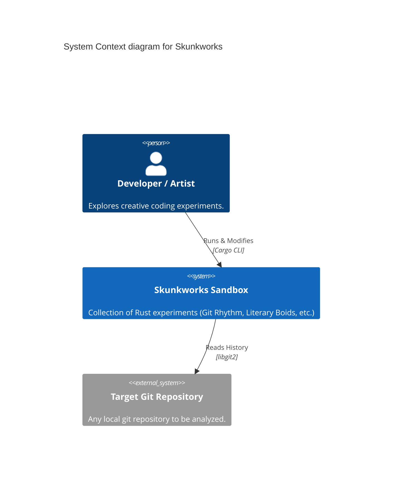
```mermaid
C4Context
    title System Context diagram for Skunkworks

    Person(user, "Developer / Artist", "Explores creative coding experiments.")
    System(skunkworks, "Skunkworks Sandbox", "Collection of Rust experiments (Git Rhythm, Literary Boids, etc.)")
    System_Ext(git_repo, "Target Git Repository", "Any local git repository to be analyzed.")

    Rel(user, skunkworks, "Runs & Modifies", "Cargo CLI")
    Rel(skunkworks, git_repo, "Reads History", "libgit2")
```

## Shared Infrastructure

Common components used across multiple experiments to enforce consistency and reduce boilerplate.

### TUI Lifecycle (crates/tui-shared)

The `tui-shared` crate provides a RAII wrapper for Ratatui terminal initialization.

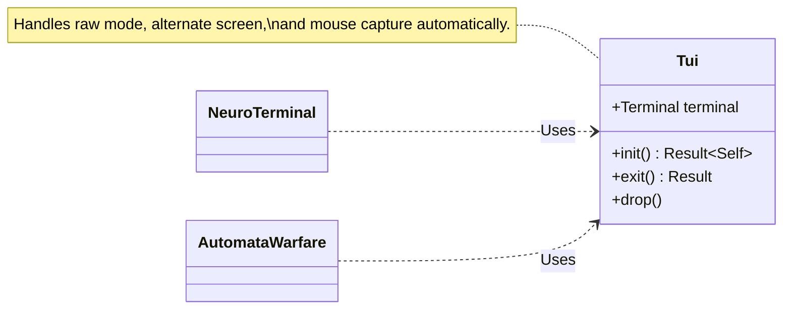
```mermaid
classDiagram
    direction LR
    class Tui {
        +Terminal terminal
        +init() Result~Self~
        +exit() Result
        +drop()
    }

    class NeuroTerminal
    class AutomataWarfare

    NeuroTerminal ..> Tui : Uses
    AutomataWarfare ..> Tui : Uses

    note for Tui "Handles raw mode, alternate screen,\nand mouse capture automatically."
```

### Semantic Bridge (crates/tui-semantic)

The `tui-semantic` crate enables applications to expose their internal state as structured data for LLM agents.

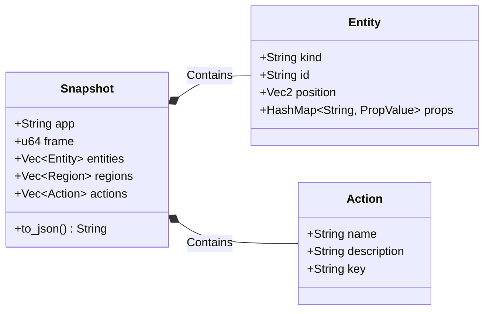
```mermaid
classDiagram
    direction LR

    class Snapshot {
        +String app
        +u64 frame
        +Vec~Entity~ entities
        +Vec~Region~ regions
        +Vec~Action~ actions
        +to_json() String
    }

    class Entity {
        +String kind
        +String id
        +Vec2 position
        +HashMap~String, PropValue~ props
    }

    class Action {
        +String name
        +String description
        +String key
    }

    Snapshot *-- Entity : Contains
    Snapshot *-- Action : Contains
```

### Poincaré Disk (crates/poincare-disk)

The `poincare-disk` crate provides hyperbolic geometry primitives, shared by `hyperbolic-git`, `chimera-lang`, and others.

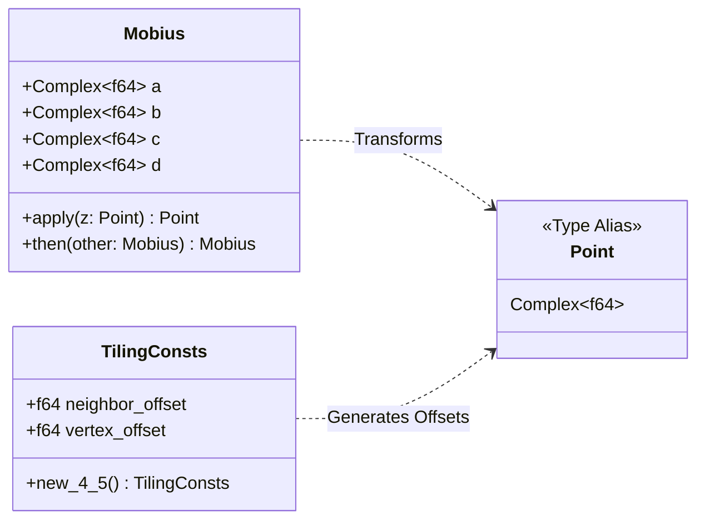
```mermaid
classDiagram
    direction LR

    class Point {
        <<Type Alias>>
        Complex~f64~
    }

    class Mobius {
        +Complex~f64~ a
        +Complex~f64~ b
        +Complex~f64~ c
        +Complex~f64~ d
        +apply(z: Point) Point
        +then(other: Mobius) Mobius
    }

    class TilingConsts {
        +f64 neighbor_offset
        +f64 vertex_offset
        +new_4_5() TilingConsts
    }

    Mobius ..> Point : Transforms
    TilingConsts ..> Point : Generates Offsets
```

### Resonance Audio (crates/resonance-audio)

The `resonance-audio` crate implements a 2D wave equation solver and audio state management, decoupled from any specific visualization.

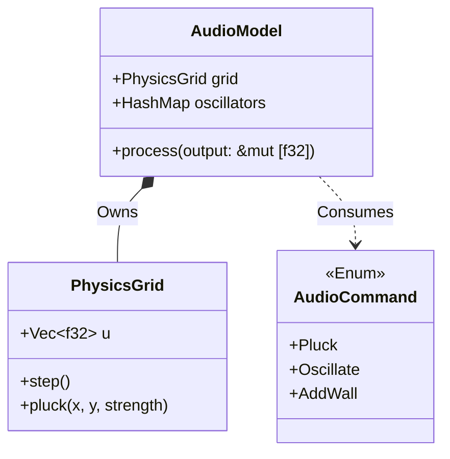
```mermaid
classDiagram
    direction TB

    class AudioModel {
        +PhysicsGrid grid
        +HashMap oscillators
        +process(output: &mut [f32])
    }

    class PhysicsGrid {
        +Vec~f32~ u
        +step()
        +pluck(x, y, strength)
    }

    class AudioCommand {
        <<Enum>>
        +Pluck
        +Oscillate
        +AddWall
    }

    AudioModel *-- PhysicsGrid : Owns
    AudioModel ..> AudioCommand : Consumes
```

### Optional Audio Backend (ADR 005)

To support CI environments without audio drivers, all audio functionality is gated behind a `feature = "audio"` flag.

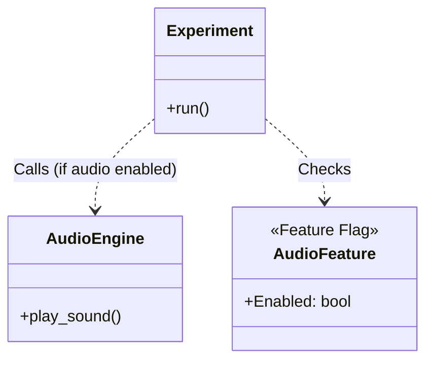
```mermaid
classDiagram
    direction TB
    class AudioFeature {
        <<Feature Flag>>
        +Enabled: bool
    }

    class Experiment {
        +run()
    }

    class AudioEngine {
        +play_sound()
    }

    Experiment ..> AudioEngine : Calls (if audio enabled)
    Experiment ..> AudioFeature : Checks
```

### Ghost Input Replay (crates/tui-shared)

The `tui-shared` crate includes a `ghost` feature for recording and replaying user input sessions, facilitating deterministic testing and demos.

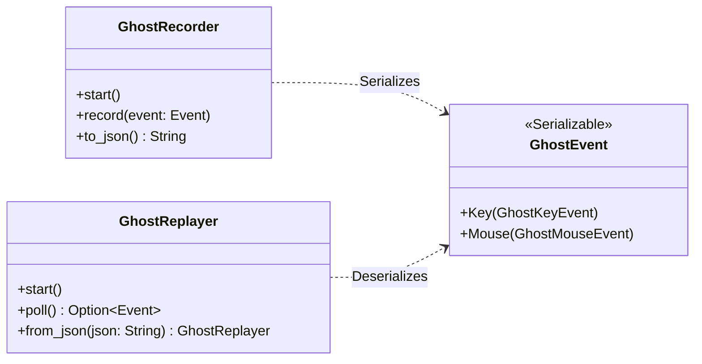
```mermaid
classDiagram
    direction LR

    class GhostRecorder {
        +start()
        +record(event: Event)
        +to_json() String
    }

    class GhostReplayer {
        +start()
        +poll() Option~Event~
        +from_json(json: String) GhostReplayer
    }

    class GhostEvent {
        <<Serializable>>
        +Key(GhostKeyEvent)
        +Mouse(GhostMouseEvent)
    }

    GhostRecorder ..> GhostEvent : Serializes
    GhostReplayer ..> GhostEvent : Deserializes
```

## Experiment: Git Harmony

**Git Harmony** (formerly Git Rhythm) generates music from git diffs ("Code Singing").

### Component Structure

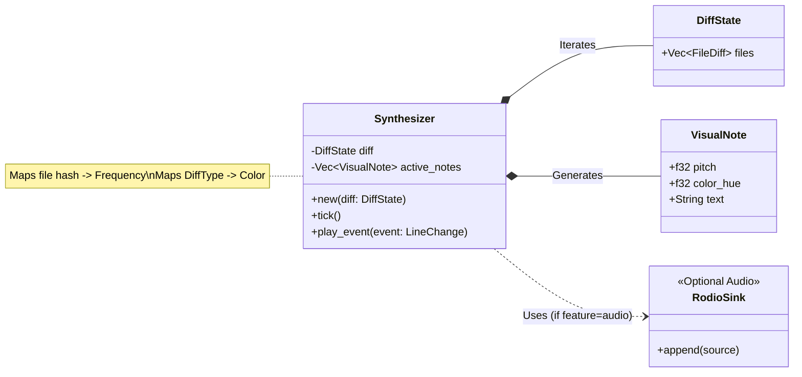
```mermaid
classDiagram
    direction LR
    class DiffState {
        +Vec~FileDiff~ files
    }

    class VisualNote {
        +f32 pitch
        +f32 color_hue
        +String text
    }

    class Synthesizer {
        -DiffState diff
        -Vec~VisualNote~ active_notes
        +new(diff: DiffState)
        +tick()
        +play_event(event: LineChange)
    }

    class RodioSink {
        <<Optional Audio>>
        +append(source)
    }

    Synthesizer *-- DiffState : Iterates
    Synthesizer *-- VisualNote : Generates
    Synthesizer ..> RodioSink : Uses (if feature=audio)

    note for Synthesizer "Maps file hash -> Frequency\nMaps DiffType -> Color"
```

## Experiment: Chimera Lang (ADR 008)

**Chimera Lang** is a bio-inspired, stack-based esoteric programming language with an optional "Nova" expansion for advanced biological simulation.

### Lib/Bin Split

The project exposes its core modules to allow embedding in other experiments.

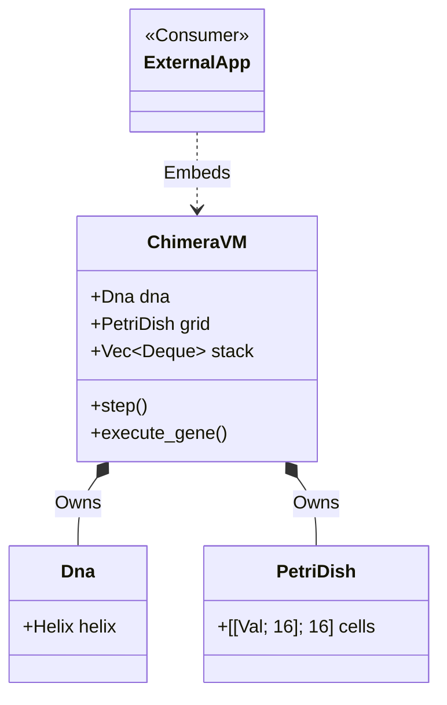
```mermaid
classDiagram
    direction TB
    class ChimeraVM {
        +Dna dna
        +PetriDish grid
        +Vec~Deque~ stack
        +step()
        +execute_gene()
    }

    class Dna {
        +Helix helix
    }

    class PetriDish {
        +[[Val; 16]; 16] cells
    }

    class ExternalApp {
        <<Consumer>>
    }

    ChimeraVM *-- Dna : Owns
    ChimeraVM *-- PetriDish : Owns
    ExternalApp ..> ChimeraVM : Embeds
```

### Nova Feature: Endocrine Cycle

When `feature = "nova"` is enabled, the VM simulates a hormone diffusion cycle.

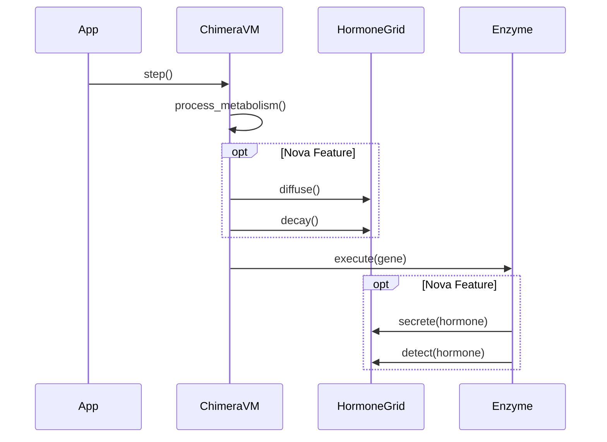
```mermaid
sequenceDiagram
    participant App
    participant VM as ChimeraVM
    participant Endocrine as HormoneGrid
    participant Enzyme

    App->>VM: step()
    VM->>VM: process_metabolism()

    opt Nova Feature
        VM->>Endocrine: diffuse()
        VM->>Endocrine: decay()
    end

    VM->>Enzyme: execute(gene)

    opt Nova Feature
        Enzyme->>Endocrine: secrete(hormone)
        Enzyme->>Endocrine: detect(hormone)
    end
```

### Nova Feature: Time Travel (ADR 013)

The `Spore` struct enables deep state snapshots, allowing the VM to backtrack execution paths.

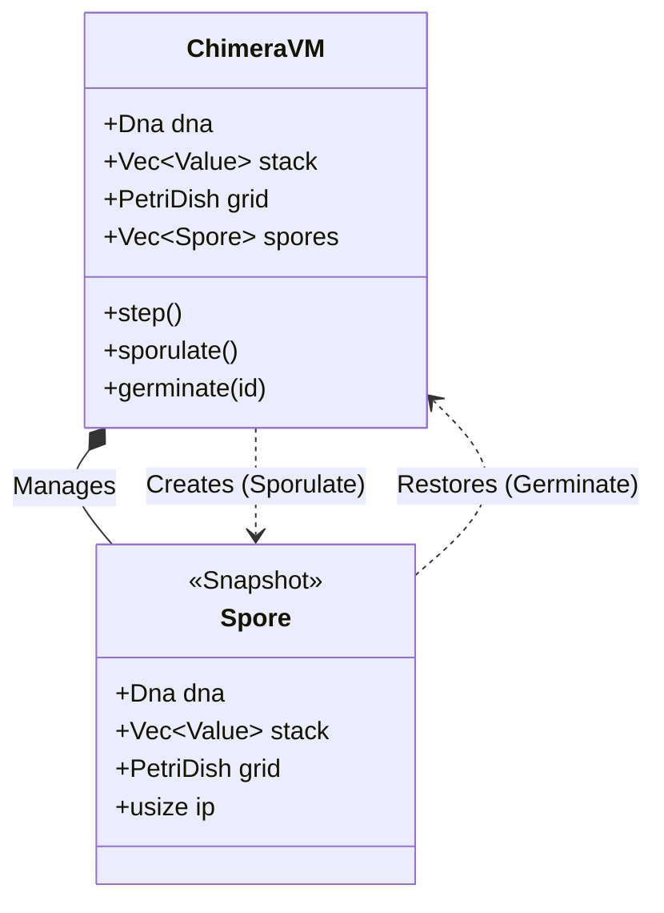
```mermaid
classDiagram
    direction TB
    class ChimeraVM {
        +Dna dna
        +Vec~Value~ stack
        +PetriDish grid
        +Vec~Spore~ spores
        +step()
        +sporulate()
        +germinate(id)
    }

    class Spore {
        <<Snapshot>>
        +Dna dna
        +Vec~Value~ stack
        +PetriDish grid
        +usize ip
    }

    ChimeraVM *-- Spore : Manages
    ChimeraVM ..> Spore : Creates (Sporulate)
    Spore ..> ChimeraVM : Restores (Germinate)
```

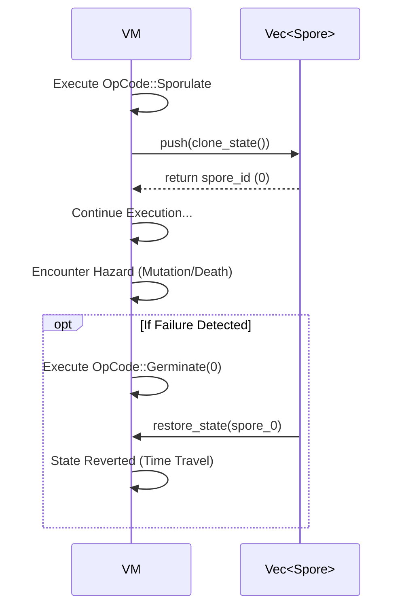
```mermaid
sequenceDiagram
    participant VM
    participant SporeStorage as Vec<Spore>

    VM->>VM: Execute OpCode::Sporulate
    VM->>SporeStorage: push(clone_state())
    SporeStorage-->>VM: return spore_id (0)
    VM->>VM: Continue Execution...
    VM->>VM: Encounter Hazard (Mutation/Death)

    opt If Failure Detected
        VM->>VM: Execute OpCode::Germinate(0)
        SporeStorage->>VM: restore_state(spore_0)
        VM->>VM: State Reverted (Time Travel)
    end
```

### Nova Feature: Prion Protocol (ADR 013)

Dynamic instruction remapping allows the environment or the program itself to alter the meaning of genes.

```mermaid
stateDiagram-v2
    [*] --> Normal
    Normal --> Remapped : OpCode::Remap(Add, Sub)
    Remapped --> Normal : OpCode::Restore(Add)

    state Normal {
        Add : Adds two numbers
    }

    state Remapped {
        Add : Subtracts two numbers (Prion)
    }
```

### Nova Feature: Chorus System (ADR 014)

The Chorus System allows the VM to trigger global effects by detecting specific sequences of "notes" (strings) in a sliding window buffer.

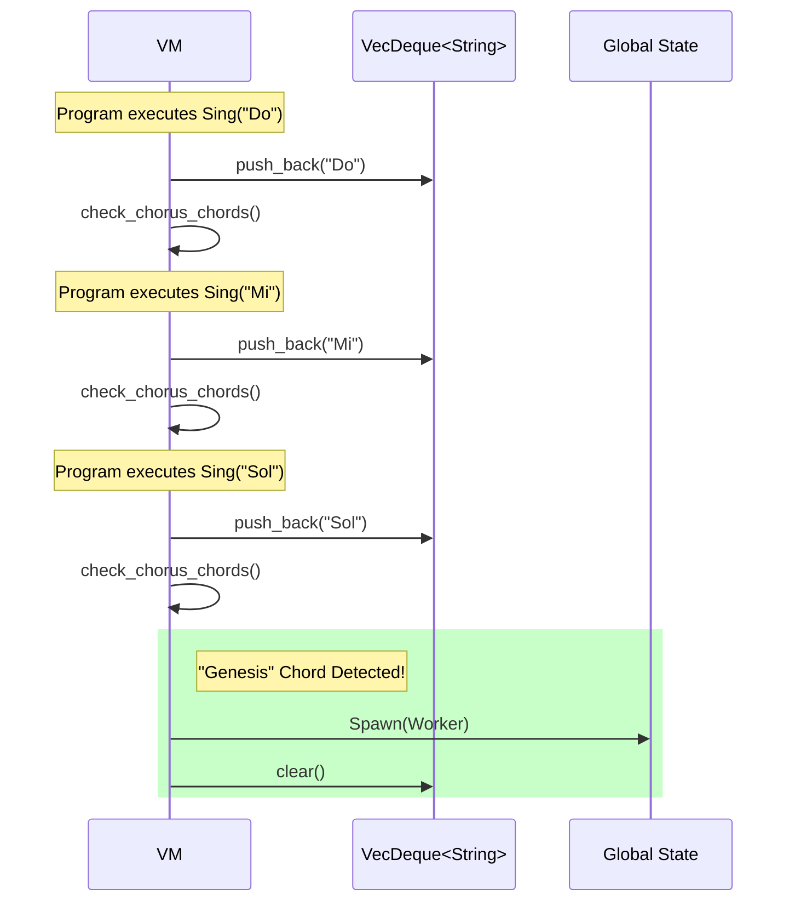
```mermaid
sequenceDiagram
    participant VM
    participant ChorusBuffer as VecDeque<String>
    participant State as Global State

    Note over VM: Program executes Sing("Do")
    VM->>ChorusBuffer: push_back("Do")
    VM->>VM: check_chorus_chords()

    Note over VM: Program executes Sing("Mi")
    VM->>ChorusBuffer: push_back("Mi")
    VM->>VM: check_chorus_chords()

    Note over VM: Program executes Sing("Sol")
    VM->>ChorusBuffer: push_back("Sol")
    VM->>VM: check_chorus_chords()

    rect rgb(200, 255, 200)
        Note right of VM: "Genesis" Chord Detected!
        VM->>State: Spawn(Worker)
        VM->>ChorusBuffer: clear()
    end
```

### Phylogeny Feature: Host Interaction (ADR 017)

The `phylogeny` feature enables the VM to escape its sandbox and interact with the host filesystem and shell.

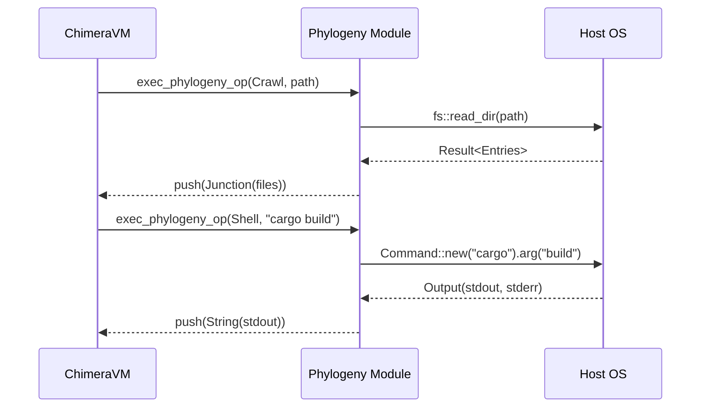
```mermaid
sequenceDiagram
    participant VM as ChimeraVM
    participant Phy as Phylogeny Module
    participant OS as Host OS

    VM->>Phy: exec_phylogeny_op(Crawl, path)
    Phy->>OS: fs::read_dir(path)
    OS-->>Phy: Result<Entries>
    Phy-->>VM: push(Junction(files))

    VM->>Phy: exec_phylogeny_op(Shell, "cargo build")
    Phy->>OS: Command::new("cargo").arg("build")
    OS-->>Phy: Output(stdout, stderr)
    Phy-->>VM: push(String(stdout))
```

## Core Architecture Changes (ADR 006)

Refactoring to decouple storage from core logic to resolve circular dependencies.

### Core vs Storage

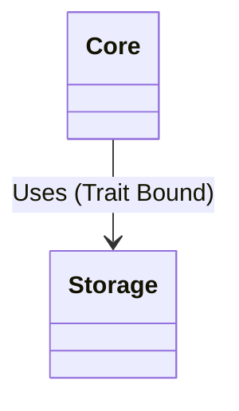
```mermaid
classDiagram
  class Core
  class Storage
  Core --> Storage : Uses (Trait Bound)
  %% Removed the circular dependency arrow (ADR 006)
```

### Storage Flow

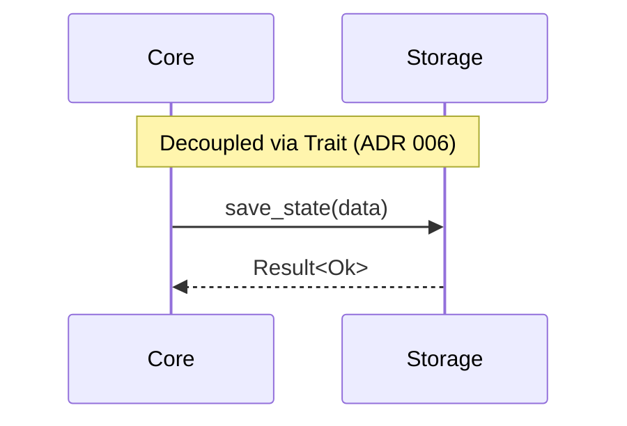
```mermaid
sequenceDiagram
    participant C as Core
    participant S as Storage

    Note over C,S: Decoupled via Trait (ADR 006)
    C->>S: save_state(data)
    S-->>C: Result<Ok>
```

### Chimera Feature: Sovereignty (ADR 018)

The Sovereignty system enables organisms to claim territory and tax visitors.

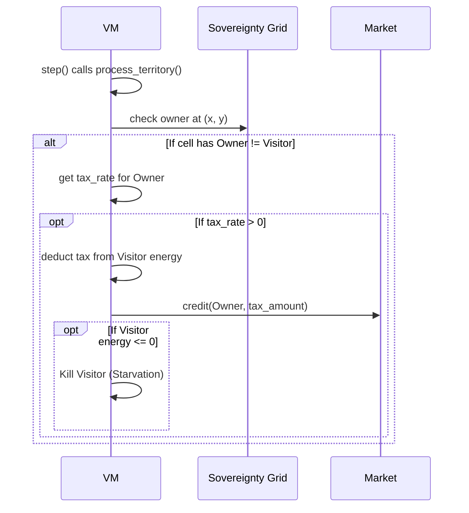
```mermaid
sequenceDiagram
    participant VM
    participant SovGrid as Sovereignty Grid
    participant Market

    VM->>VM: step() calls process_territory()
    VM->>SovGrid: check owner at (x, y)

    alt If cell has Owner != Visitor
        VM->>VM: get tax_rate for Owner

        opt If tax_rate > 0
            VM->>VM: deduct tax from Visitor energy
            VM->>Market: credit(Owner, tax_amount)

            opt If Visitor energy <= 0
                VM->>VM: Kill Visitor (Starvation)
            end
        end
    end
```

### Nova Feature: Chemistry System (ADR 019)

The Chemistry system allows for the creation and manipulation of chemical solutions using recipes.

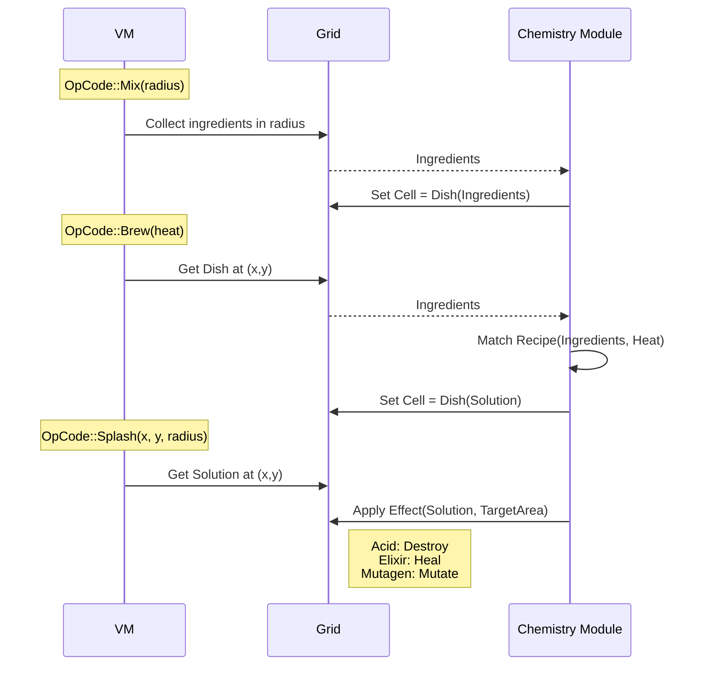
```mermaid
sequenceDiagram
    participant VM
    participant Grid
    participant Chemistry as Chemistry Module

    Note over VM: OpCode::Mix(radius)
    VM->>Grid: Collect ingredients in radius
    Grid-->>Chemistry: Ingredients
    Chemistry->>Grid: Set Cell = Dish(Ingredients)

    Note over VM: OpCode::Brew(heat)
    VM->>Grid: Get Dish at (x,y)
    Grid-->>Chemistry: Ingredients
    Chemistry->>Chemistry: Match Recipe(Ingredients, Heat)
    Chemistry->>Grid: Set Cell = Dish(Solution)

    Note over VM: OpCode::Splash(x, y, radius)
    VM->>Grid: Get Solution at (x,y)
    Chemistry->>Grid: Apply Effect(Solution, TargetArea)
    Note right of Grid: Acid: Destroy<br/>Elixir: Heal<br/>Mutagen: Mutate
```

### Nova Feature: Hive Networking (ADR 020)

The Hive system enables asynchronous UDP communication between Chimera VMs, facilitating distributed simulation and swarm behavior.

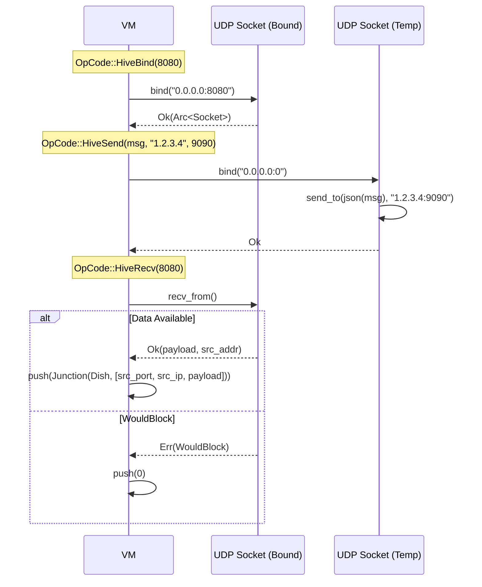
```mermaid
sequenceDiagram
    participant VM
    participant HiveSocket as UDP Socket (Bound)
    participant Ephemeral as UDP Socket (Temp)

    Note over VM: OpCode::HiveBind(8080)
    VM->>HiveSocket: bind("0.0.0.0:8080")
    HiveSocket-->>VM: Ok(Arc<Socket>)

    Note over VM: OpCode::HiveSend(msg, "1.2.3.4", 9090)
    VM->>Ephemeral: bind("0.0.0.0:0")
    Ephemeral->>Ephemeral: send_to(json(msg), "1.2.3.4:9090")
    Ephemeral-->>VM: Ok

    Note over VM: OpCode::HiveRecv(8080)
    VM->>HiveSocket: recv_from()
    alt Data Available
        HiveSocket-->>VM: Ok(payload, src_addr)
        VM->>VM: push(Junction(Dish, [src_port, src_ip, payload]))
    else WouldBlock
        HiveSocket-->>VM: Err(WouldBlock)
        VM->>VM: push(0)
    end
```
