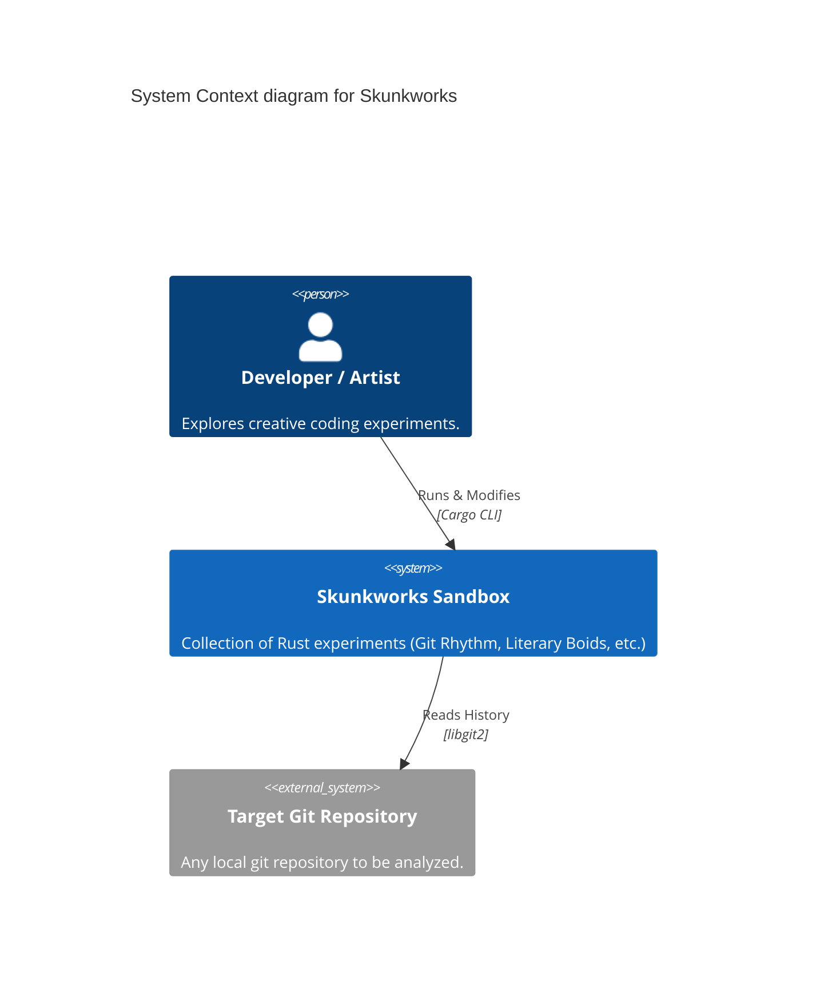
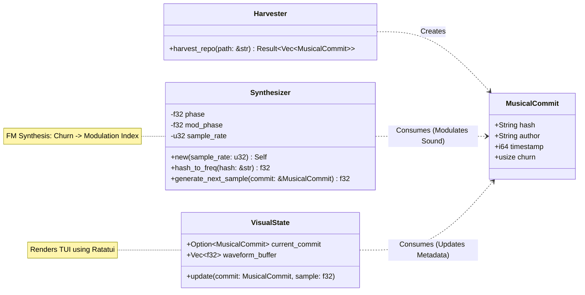

# System Architecture

## System Context (C4)

The **Skunkworks** repository is an experimental sandbox for creative coding projects in Rust.

## Experiment: Git Rhythm

**Git Rhythm** sonifies and visualizes the history of a git repository.

### Component Structure

