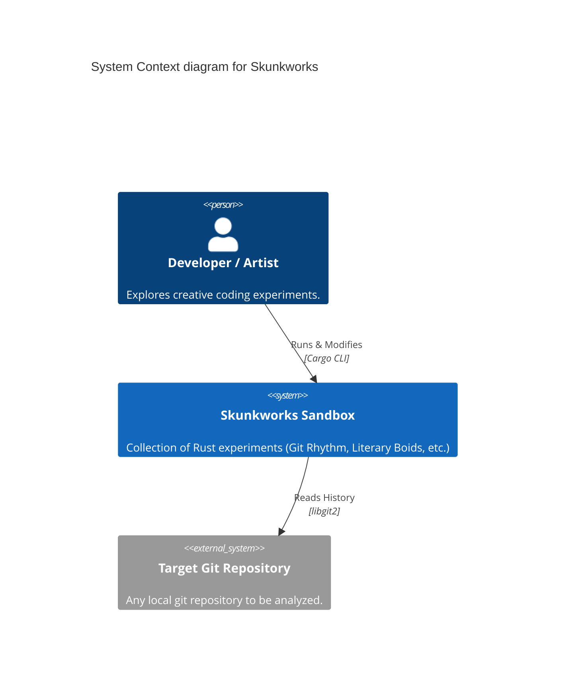
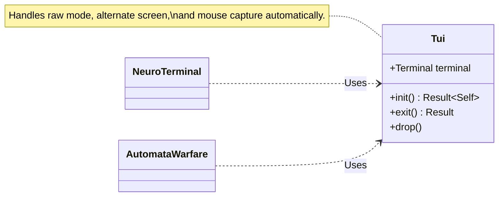
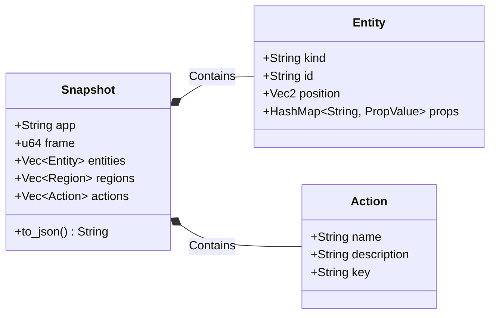
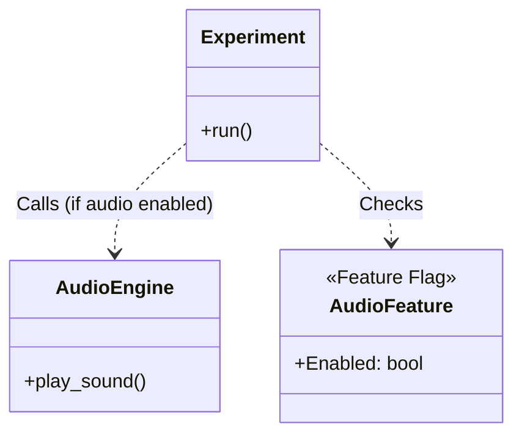
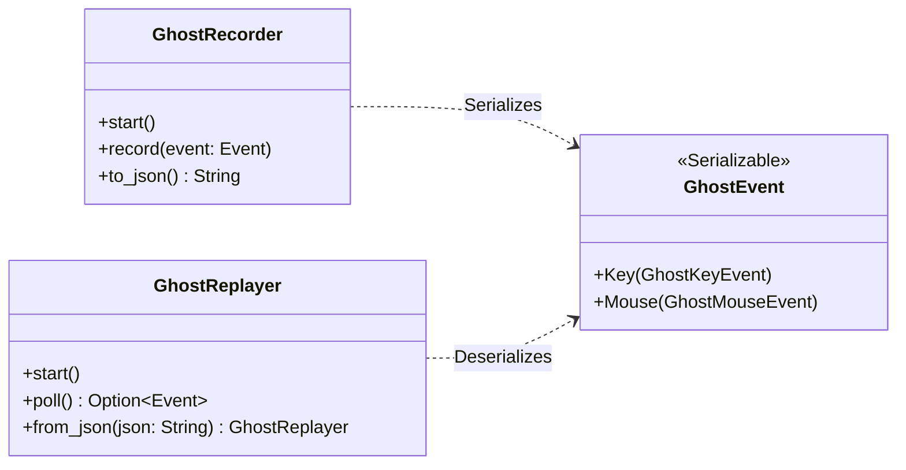
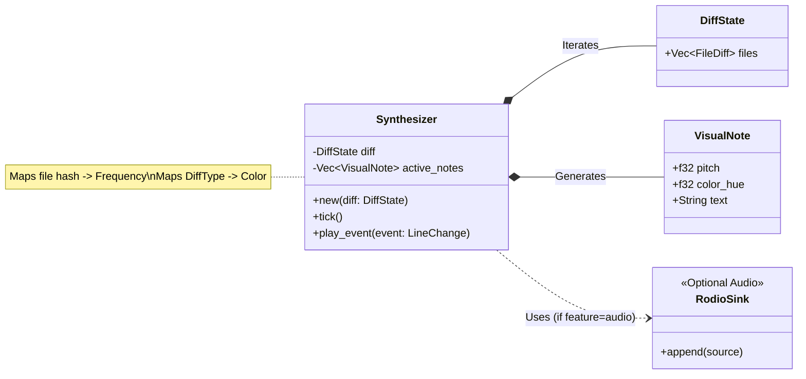
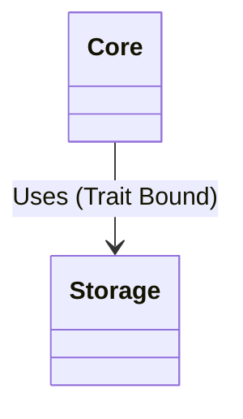
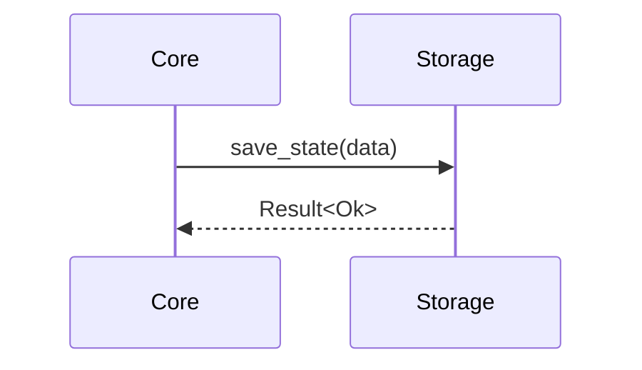

# System Architecture

## System Context (C4)

The **Skunkworks** repository is an experimental sandbox for creative coding projects in Rust.

## Shared Infrastructure

Common components used across multiple experiments to enforce consistency and reduce boilerplate.

### TUI Lifecycle (crates/tui-shared)

The `tui-shared` crate provides a RAII wrapper for Ratatui terminal initialization.

### Semantic Bridge (crates/tui-semantic)

The `tui-semantic` crate enables applications to expose their internal state as structured data for LLM agents.

### Optional Audio Backend (ADR 005)

To support CI environments without audio drivers, all audio functionality is gated behind a `feature = "audio"` flag.

### Ghost Input Replay (crates/tui-shared)

The `tui-shared` crate includes a `ghost` feature for recording and replaying user input sessions, facilitating deterministic testing and demos.

## Experiment: Git Harmony

**Git Harmony** (formerly Git Rhythm) generates music from git diffs ("Code Singing").

### Component Structure

## Core Architecture Changes

Refactoring to decouple storage from core logic.

### Core vs Storage

### Storage Flow

